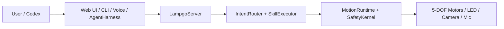

# YareLampGo

[简体中文](README.md) | English

> Turn a robotic desk lamp into a desktop companion that can listen, see, move, and respond with motion and expression.

[](LICENSE)
[](https://www.python.org/downloads/)
[](https://github.com/astral-sh/uv)

<p align="center">
  
</p>

YareLampGo lowers the barrier to playing with robotic arms and embodied AI. A 5-DOF robotic arm is usually closer to lab equipment than a toy; YareLampGo connects motors, lights, camera, microphone, and LLM tooling into a local software system so developers, creators, and hobbyists can quickly build desktop interactions through the Web UI, CLI, natural language, or an Agent.

The `lampgo` name remains the internal short name for the Python package, CLI command, and config directory.

YareLampGo ships with a local Web console, CLI, HTTP / WebSocket APIs, and zero-config local Codex integration. It also has a no-hardware mode so you can try the software flow before connecting a real device.

## Highlights

- **Control a real lamp with natural language**: say "nod", "look at me", or "act shy" to trigger motion, lights, speech, and Agent actions.
- **Web console out of the box**: chat, play motions, record actions, switch expressions, inspect device state, and update settings in the browser.
- **Guided Wi-Fi provisioning and calibration**: connect the ESP32 to 2.4GHz Wi-Fi, then calibrate motors before large movements.
- **Record and reuse motion**: manually move the lamp, save motion parameters, and replay them from the Web UI, CLI, natural language, or Codex.
- **Non-technical users can extend scenes**: describe scenes like "welcome me home" or "act shy after praise" in natural language, then turn atomic or composed motions into reusable desktop skills.
- **Codex can call real hardware**: LampGo automatically registers local MCP tools so Codex can read state, move joints, capture camera frames, and ask the user for confirmation.
- **Develop without hardware**: `--no-hw` keeps the Web UI, config, skills, routing, and Agent flow available without the physical lamp.


## Who Is It For?

- **Software developers** who want real hardware interaction without starting from motor control and serial protocols.
- **Creators and streamers** who want a desktop device that can move, react, and perform on camera.
- **AI hardware prototype teams** that want to test smart-lamp, desktop-arm, or embodied-AI scenarios quickly.
- **Agent builders** who want Agents to call motors, lights, cameras, and voice instead of only web pages and files.

## Quick Start

### 1. Clone The Repository

```bash
git clone https://github.com/ninsmiracle/YareLampGo.git
cd YareLampGo
```

### 2. Install Everything With One Command

macOS / Linux:

```bash
./install.sh
```

Windows PowerShell:

```powershell
powershell -ExecutionPolicy Bypass -File .\install.ps1
```

The installer detects the OS and CPU, bootstraps `uv` and Python 3.12, then uses `uv.lock` to install every runtime dependency, including the public LiveKit voice SDK. Failures identify the exact stage and write a complete log under `~/.lampgo/logs/`. The complete dependency matrix currently covers macOS 14+ on Apple Silicon, Windows x64, and common glibc Linux distributions. Windows dependency installation is supported, while LampGo's runtime IPC and process management are still being ported.

### 3. Run First-Time Setup

```bash
uv run lampgo onboard
```

The onboarding flow checks the environment, configures hardware ports, writes model credentials, creates persona files, and automatically connects a logged-in local Codex installation. Config files are written to `~/.lampgo/`; sensitive credentials live in `~/.lampgo/credentials.json`.

### 4. Start The Web Console

```bash
uv run lampgo run --web
```

Open <http://127.0.0.1:8420> to use chat, motions, recording, expressions, and settings.

No hardware yet? Start the software-only mode:

```bash
uv run lampgo run --web --no-hw
```

### 5. Provision Hardware Wi-Fi

For real hardware, connect the ESP32 to the same 2.4GHz Wi-Fi as your computer. Even finished devices usually need this first-time provisioning step.

1. Open the Web console settings page and click Wi-Fi provisioning.
2. Connect your computer to the device hotspot `Lampgo-Setup-XXXX`. The default password is `lampgo123`. If the OS warns that the network has no internet, stay connected.
3. Return to the provisioning wizard, select the 2.4GHz Wi-Fi that the lamp should join, enter the Wi-Fi password, and send it.
4. Wait for the device to close the temporary hotspot and reconnect. Continue after the Web console discovers `lampgo-cam-XXXX.local` or the device IP.

| Connect device hotspot | Select 2.4GHz Wi-Fi | Wait for reconnect |
| --- | --- | --- |
|  |  |  |

### 6. Calibrate A New Device

Before large movements, calibrate the motors when connecting a real lamp for the first time, replacing motors, rebuilding the structure, or changing the controller.

```bash
uv run lampgo detect
uv run lampgo calibrate
```

### macOS Music Mode Permission

`uv run lampgo onboard` prepares the system-audio helper used by music mode. The first time you use music mode, macOS asks for screen and system-audio recording permission. Allow it, then restart YareLampGo.

## Common Commands

```bash
uv run lampgo help                         # Show common debug commands
uv run lampgo status                       # Check daemon status
uv run lampgo detect                       # Detect serial ports
uv run lampgo skills                       # List available skills

uv run lampgo text "act shy"               # Natural-language routing
uv run lampgo invoke dance                 # Invoke a built-in skill
uv run lampgo move base_yaw=30             # Move a joint directly
uv run lampgo play shy                     # Replay a recorded motion
uv run lampgo record my_action --fps 30    # Teach-record a new motion

uv run lampgo calibrate                    # Interactive motor calibration
uv run lampgo estop                        # Emergency stop
uv run lampgo clear                        # Clean up processes and release ports
```

See [Quick Start](docs/getting-started/quick-start.md) for more details.

### Motion Demos

| Heart response | Wink interaction |
| --- | --- |
|  |  |

## Architecture At A Glance



Every motion goes through `MotionRuntime` and `SafetyKernel` before it reaches physical hardware. See [Architecture](docs/architecture.md) for the detailed module guide.

## Positioning And Boundaries

YareLampGo is trying to do one thing first: make a desktop robotic lamp easy to start, debug, and extend. It is not a VLA / RL paper-reproduction repo, and it does not ship a complex training stack today. Contributions in data collection, imitation learning, VLA, RL, or more serious robotics algorithms are welcome; the Web UI, CLI, motion recording flow, and hardware APIs are meant to give those experiments somewhere practical to land.

YareLampGo is an independent project. Its motor path uses `lerobot[feetech]`, and a small part of the HAL integration work is inspired by LeLamp. See [NOTICE](NOTICE) for the exact attribution and license boundary.

We also want the lamp head to become more like a replaceable module over time: magnetic or snap-on, not only a lamp, but potentially a phone holder, small speaker, or airflow module that would need extra safety review. See [Roadmap](docs/roadmap.en.md) for the longer version.

## Documentation

| Category | Docs |
| --- | --- |
| Start | [Docs index](docs/README.en.md), [Quick Start](docs/getting-started/quick-start.md), [Configuration](docs/getting-started/configuration.md) |
| Guides | [Motion and Expression](docs/guides/motion-and-expression.md), [Codex Integration](docs/guides/codex-integration.md) |
| Hardware | [Public Hardware Docs](docs/hardware/README.en.md), [Wiring Table](docs/hardware/wiring.md), [Printable Structure Files](assets/printable/README.en.md) |
| Architecture | [Architecture](docs/architecture.md), [Project Description](docs/project_description.md), [Roadmap](docs/roadmap.en.md) |
| Development | [Contributing](docs/development/contributing.md), [Examples](examples/) |

## Codex Integration

When Codex is installed and logged in, starting LampGo automatically discovers the CLI, registers its stdio MCP tools, and reports “Codex connected.” Complex tasks run in the local Codex process, which can safely call LampGo tools.

```bash
uv run lampgo run --web
```

No token, port, or environment variable setup is required. See [Codex Integration](docs/guides/codex-integration.md) for details.

## Contributing

We welcome shared motions, desktop interaction cases, composed skill scenarios, Codex workflows, hardware adaptations, and documentation improvements.

- Motion assets: add reviewed CSV recordings under `assets/recordings/` with a short description.
- Cases and scripts: add examples under `examples/` or docs, and explain the scenario they fit.
- Composed skill scenarios: see `docs/examples/` and [Composed Skills](docs/composed_skills.md); describe the trigger, steps, and safety boundary.

Minimal contribution flow:

```bash
./install.sh --dev
uv run ruff check lampgo tests
uv run pytest
```

Keep each PR focused. For hardware or motion changes, describe the tested device, serial port, calibration file, motion effect, and whether `--no-hw` was covered. See [Contributing](docs/development/contributing.md) for more.

## License

Software source code in this repository is licensed under [GNU General Public License v3.0 only](LICENSE). Authorship and attribution are listed in [AUTHORS.md](AUTHORS.md), [COPYRIGHT](COPYRIGHT), and [NOTICE](NOTICE).

Hardware, appearance, runtime 3D models, and 3D-printable files do not automatically inherit the software license; see [ASSET_LICENSES.md](ASSET_LICENSES.md). The current GLB is a Web visualization asset licensed under CC-BY-NC-SA-4.0 for non-commercial sharing and adaptation. Public community reproduction / printable appearance and structural files live in [assets/printable/](assets/printable/README.en.md), including the V1.0 STEP/STP files and preview images, and default to CERN-OHL-W-2.0.

Production CAD, supplier production drawings, quotations, and manufacturing process files are not included in the public repository unless a file is explicitly listed in the asset license table or a local license notice.
