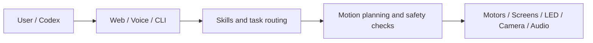

# YareLampGo

[简体中文](README.md) | English

> An open-source desktop AI robotic lamp that can listen, see, move, and answer with expressions.

[](LICENSE)
[](https://www.python.org/downloads/)
[](https://github.com/astral-sh/uv)

<p align="center">
  
  
</p>
<p align="center"><sub>V2.0 time mode · V2.0 wave mode</sub></p>

YareLampGo puts motors, screens, RGB LEDs, a camera, microphones, and LLM tooling into one desk lamp. Control it from the Web UI, talk to it directly, or let Codex guide setup, diagnose problems, and handle complex tasks.

## What It Can Do

- **Move and express itself.** A 5-DOF arm, animated eyes, and an RGB matrix respond together.
- **Look around.** The camera can capture a scene, scan for a target, detect a face or presence, and track a colored marker in cat-teaser mode.
- **Listen and speak.** Speech recognition, the `Hi,小星` wake phrase, TTS, and real-time voice sessions are supported.
- **Create new expressions.** Draw on the 51×9 LED canvas, upload eye animations, or let an AI produce assets in the safe expression format.
- **Hand complex work to Codex.** Fast requests stay local; complex tasks can run in the local Codex process, which can inspect status, use the camera, and invoke safe lamp actions.
- **Work for non-technical users.** Chat, move, draw expressions, record motions, and change settings in the browser.
- **Open software, firmware, wiring references, and a V2 structural assembly.** Remix the project or split the STEP assembly into parts for 3D printing.

## Have Codex? Let It Guide Setup

The repository includes a `$lampgo-setup` skill. It does not merely show another installation article: it inspects what you have and works through the setup interactively.

macOS / Linux:

```bash
git clone https://github.com/ninsmiracle/YareLampGo.git
cd YareLampGo
./install-codex-skill.sh
```

Windows PowerShell:

```powershell
git clone https://github.com/ninsmiracle/YareLampGo.git
Set-Location YareLampGo
powershell -ExecutionPolicy Bypass -File .\install-codex-skill.ps1
```

Start a new Codex task and say:

```text
Use $lampgo-setup to install and configure my YareLampGo V2.0.
```

The skill selects software-only, assembled-unit, or DIY setup. It performs safe work directly, then pauses before servo-ID writes, firmware flashing, first 12V power, calibration, and the first real motion. It follows the user's language and defaults to Simplified Chinese when there is no language context.

See [Codex Integration](docs/guides/codex-integration.md) for details.

## Prefer Manual Setup?

Manual installation and flashing are still fully documented. The DIY sequence is: install software → assign servo IDs 1–5 → flash the S3/C6 → assemble and verify power while unpowered → scan motors → calibrate → provision and start.

See [Manual V2.0 Setup, Flashing, and First Start](docs/getting-started/manual-hardware-setup.en.md) for commands, safety checks, and Windows/macOS/Linux notes. Use the separate [YareLampGo_esp32](https://github.com/shelly-tang/YareLampGo_esp32) repository as the source of truth for firmware flashing.

## Try The Software First

No hardware is required for the Web console:

```bash
./install.sh
uv run lampgo onboard
uv run lampgo run --web --no-hw
```

Open <http://127.0.0.1:8420>. See [Quick Start](docs/getting-started/quick-start.md) for Windows and real-hardware setup.

## Common Commands

```bash
uv run lampgo help                 # CLI explanations and copyable examples
uv run lampgo detect               # Find serial ports, cameras, and ESP32 devices
uv run lampgo scan-motors --ids 1-5
uv run lampgo calibrate            # Interactive five-joint calibration
uv run lampgo run --web            # Start the physical lamp and Web console
uv run lampgo run --web --no-hw    # Software-only Web console
uv run lampgo status               # Inspect the running daemon
uv run lampgo clear                # Stop leftovers and release motor torque
```

For command-specific options, run `uv run lampgo <command> --help`.

## Build V2.0

V2.0 replaces V1.0. Do not mix structures, wiring, or calibration files across generations.

| What you need | Entry point |
| --- | --- |
| V2 hardware, assembly, and first power | [V2.0 Hardware and Assembly](docs/hardware/v2/README.en.md) |
| Power, S3/C6, audio, LED, and servo wiring | [V2.0 Wiring](docs/hardware/wiring.md) |
| Complete STEP assembly | [V2.0 Structure](assets/printable/README.en.md) |
| GitHub-readable illustrated assembly guide | [Assembly guide Markdown (Chinese)](docs/hardware/v2/YareLampGo_V2.0_assembly_manual.md) |
| Original illustrated assembly guide | [Assembly DOCX download](docs/hardware/v2/YareLampGo_V2.0_assembly_manual.docx) |
| S3/C6 firmware | [YareLampGo_esp32](https://github.com/shelly-tang/YareLampGo_esp32) |

The current release contains a complete STEP assembly, not pre-split STL/3MF files. The electrical PNGs are wiring and routing references, not a board-house-ready Gerber package.

## Things To Try

| Mode | What it does |
| --- | --- |
| [Time mode](docs/images/readme/lampgo_v2_time_mode.gif) | Shows the time on the matrix while the upper screen displays an eye expression. |
| [Wave mode](docs/images/readme/lampgo_v2_wave_mode.gif) | Sweeps the head while coordinating the front light and eyes. |
| Cat-teaser mode | Tracks a colored marker on a teaser wand and reacts to motion near the marker. |
| Music motion | On macOS, the lamp can move with system audio. |
| Custom scenes | Record motions and combine motion, expression, light, and speech in a user skill. |

Clock, wave, and cat-teaser behavior exist today. Silent reminders, welcome-home scenes, and other ideas can be built as composed skills.

## Codex Does More Than Installation

At runtime LampGo discovers the local Codex CLI and registers MCP tools automatically—no manual token or port configuration:

```bash
uv run lampgo run --web
```

- Say “call Codex” to hand the current task to the local Codex process.
- Codex can inspect status, invoke safe actions, capture a camera frame, or ask the user a question.
- LampGo can reference the Codex memory summary and, with confirmation, import Agent profile and core-memory files.
- Other Agents can integrate through the CLI, HTTP / WebSocket APIs, or skill layer.

## How It Works



Real motion passes through `MotionRuntime` and `SafetyKernel` before reaching the motors. See [Architecture](docs/architecture.md).

## Documentation

| Goal | Read this |
| --- | --- |
| First run | [Quick Start](docs/getting-started/quick-start.md) |
| Manual setup, flashing, servo IDs, and first power | [Manual V2.0 Setup](docs/getting-started/manual-hardware-setup.en.md) |
| Models, voice, camera, and device settings | [Configuration](docs/getting-started/configuration.md) |
| Motion, expressions, and composed scenes | [Motion and Expression](docs/guides/motion-and-expression.md) · [Composed Skills](docs/composed_skills.md) |
| Codex integration | [Codex Integration](docs/guides/codex-integration.md) |
| Codebase overview | [Architecture](docs/architecture.md) · [Project Description](docs/project_description.md) |
| Development | [Contributing](docs/development/contributing.md) |

## Contributing

Motion recordings, expressions, composed skills, hardware adaptations, and real-world cases are welcome. Keep each PR focused. For physical hardware work, state the device, calibration, observed motion result, and whether `--no-hw` was tested.

YareLampGo is an independent project. Its motor path uses `lerobot[feetech]`, and a small part of the HAL integration is inspired by LeLamp. See [NOTICE](NOTICE) for attribution.

## License

Software source code uses [GPL-3.0-only](LICENSE). See [AUTHORS.md](AUTHORS.md), [COPYRIGHT](COPYRIGHT), and [NOTICE](NOTICE) for authorship and attribution.

Hardware, structure, 3D models, demo GIFs, and other assets have separate terms in [ASSET_LICENSES.md](ASSET_LICENSES.md). Production CAD, supplier drawings, quotations, and manufacturing files are outside the public scope unless explicitly listed in the asset-license table.
