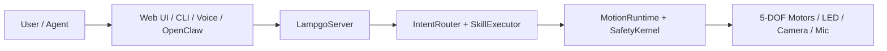

# YareLampGo

English | [简体中文](README.zh-CN.md)

> Turn a robotic desk lamp into a desktop companion that can listen, see, move, and respond with motion and expression.

[](LICENSE)
[](https://www.python.org/downloads/)
[](https://github.com/astral-sh/uv)

YareLampGo lowers the barrier to playing with robotic arms and embodied AI. A 5-DOF robotic arm is usually closer to lab equipment than a toy; YareLampGo connects motors, lights, camera, microphone, and LLM tooling into a local software system so developers, creators, and hobbyists can quickly build desktop interactions through the Web UI, CLI, natural language, or an Agent.

The `lampgo` name remains the internal short name for the Python package, CLI command, config directory, and OpenClaw plugin identifiers.

> Image placeholder: add a real hero photo or GIF of the current open-source hardware at `docs/images/readme/hero-demo.gif`.

YareLampGo ships with a local Web console, CLI, HTTP / WebSocket APIs, and an OpenClaw plugin. It also has a no-hardware mode so you can try the software flow before connecting a real device.

## Highlights

- **Control a real lamp with natural language**: say "nod", "look at me", or "act shy" to trigger motion, lights, speech, and Agent actions.
- **Web console out of the box**: chat, play motions, record actions, switch expressions, inspect device state, and update settings in the browser.
- **Calibration is part of first setup**: for a new device, replaced motor, rebuilt structure, or changed controller, run `detect` and `calibrate` before large movements.
- **Record and reuse motion**: manually move the lamp, save the motion as CSV, and replay it from the Web UI, CLI, natural language, or OpenClaw.
- **Non-technical users can extend scenes**: describe scenes like "welcome me home" or "act shy after praise" in natural language, then turn atomic or composed motions into reusable desktop skills.
- **Agents can call real hardware**: with OpenClaw, an Agent can read state, move joints, change LED expressions, capture camera frames, and ask the user for confirmation.
- **Develop without hardware**: `--no-hw` keeps the Web UI, config, skills, routing, and Agent flow available without the physical lamp.

> Image placeholder: add a Web console screenshot at `docs/images/readme/web-console.png`.

## Who Is It For?

- **Software developers** who want real hardware interaction without starting from motor control and serial protocols.
- **Creators and streamers** who want a desktop device that can move, react, and perform on camera.
- **AI hardware prototype teams** that want to test smart-lamp, desktop-arm, or embodied-AI scenarios quickly.
- **Agent builders** who want Agents to call motors, lights, cameras, and voice instead of only web pages and files.

## Quick Start

### 1. Install uv

```bash
curl -LsSf https://astral.sh/uv/install.sh | sh
```

On macOS, you can also use Homebrew:

```bash
brew install uv
```

### 2. Clone And Install

```bash
git clone https://github.com/ninsmiracle/YareLampGo.git
cd YareLampGo
uv sync
```

### 3. Run First-Time Setup

```bash
uv run lampgo onboard
```

The onboarding flow checks the environment, configures hardware ports, writes model credentials, imports persona files, and offers OpenClaw plugin installation when OpenClaw is detected. Config files are written to `~/.lampgo/`; sensitive credentials live in `~/.lampgo/credentials.json`.

### 4. Calibrate A New Device

Before large movements, calibrate the motors when connecting a real lamp for the first time, replacing motors, rebuilding the structure, or changing the controller.

```bash
uv run lampgo detect
uv run lampgo calibrate
```

### 5. Start The Web Console

```bash
uv run lampgo run --web
```

Open <http://127.0.0.1:8420> to use chat, motions, recording, expressions, and settings.

No hardware yet? Start the software-only mode:

```bash
uv run lampgo run --web --no-hw
```

### macOS Music Mode Permission

`uv run lampgo onboard` prepares the system-audio helper used by music mode. The first time you use music mode, macOS asks for screen and system-audio recording permission. Allow it, then restart YareLampGo.

## Common Commands

```bash
uv run lampgo help                         # Show common debug commands
uv run lampgo status                       # Check daemon status
uv run lampgo detect                       # Detect serial ports
uv run lampgo skills                       # List available skills

uv run lampgo text "act shy"               # Natural-language routing
uv run lampgo invoke dance                 # Invoke a built-in skill
uv run lampgo move base_yaw=30             # Move a joint directly
uv run lampgo play shy                     # Replay a recorded motion
uv run lampgo record my_action --fps 30    # Teach-record a new motion

uv run lampgo calibrate                    # Interactive motor calibration
uv run lampgo estop                        # Emergency stop
uv run lampgo clear                        # Clean up processes and release ports
```

See [Quick Start](docs/getting-started/quick-start.md) for more details.

> Image placeholder: add 1-2 motion GIFs, such as nodding, shy, dancing, or returning to a safe pose, at `docs/images/readme/motion-demo.gif`.

## Architecture At A Glance



Every motion goes through `MotionRuntime` and `SafetyKernel` before it reaches physical hardware. See [Architecture](docs/architecture.md) for the detailed module guide.

## Documentation

| Category | Docs |
| --- | --- |
| Start | [Docs index](docs/README.md), [Quick Start](docs/getting-started/quick-start.md), [Configuration](docs/getting-started/configuration.md) |
| Guides | [Motion and Expression](docs/guides/motion-and-expression.md), [OpenClaw Integration](docs/guides/openclaw-integration.md) |
| Hardware | [Public Hardware Docs](docs/hardware/README.md), [Wiring Table](docs/hardware/wiring.md), [Printable Structure Files](assets/printable/README.md) |
| Architecture | [Architecture](docs/architecture.md), [Project Description](docs/project_description.md) |
| Development | [Contributing](docs/development/contributing.md), [Examples](examples/) |

## OpenClaw Integration

YareLampGo can run as an OpenClaw hardware accessory. Agents can read lamp state, move joints, play motions, switch LED expressions, capture camera frames, write memory, or ask the user for confirmation.

```bash
uv run lampgo run --web
uv run lampgo install-openclaw --yes
```

See [OpenClaw Integration](docs/guides/openclaw-integration.md) for details.

## Contributing

We welcome shared motions, desktop interaction cases, composed skill scenarios, OpenClaw workflows, hardware adaptations, and documentation improvements.

- Motion assets: add reviewed CSV recordings under `assets/recordings/` with a short description.
- Cases and scripts: add examples under `examples/` or docs, and explain the scenario they fit.
- Composed skill scenarios: see `docs/examples/` and [Composed Skills](docs/composed_skills.md); describe the trigger, steps, and safety boundary.

Minimal contribution flow:

```bash
uv sync --group dev
uv run ruff check lampgo tests
uv run pytest
```

Keep each PR focused. For hardware or motion changes, describe the tested device, serial port, calibration file, motion effect, and whether `--no-hw` was covered. See [Contributing](docs/development/contributing.md) for more.

## License

Software source code in this repository is licensed under [GNU General Public License v3.0 only](LICENSE). Authorship and attribution are listed in [AUTHORS.md](AUTHORS.md), [COPYRIGHT](COPYRIGHT), and [NOTICE](NOTICE).

Hardware, appearance, runtime 3D models, and 3D-printable files do not automatically inherit the software license; see [ASSET_LICENSES.md](ASSET_LICENSES.md). The current GLB is a Web visualization asset licensed under CC-BY-NC-SA-4.0 for non-commercial sharing and adaptation. Public community reproduction / printable appearance and structural files live in [assets/printable/](assets/printable/README.md), including the V1.0 STEP/STP files and preview images, and default to CERN-OHL-W-2.0.

Production CAD, supplier production drawings, quotations, and manufacturing process files are not included in the public repository unless a file is explicitly listed in the asset license table or a local license notice.
