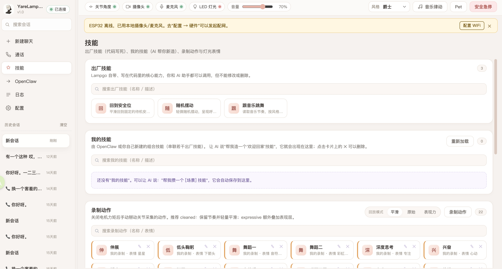
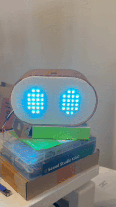
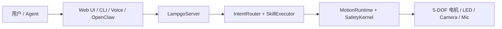

# YareLampGo

简体中文 | [English](README.en.md)

> 把机械臂台灯变成普通人也能玩起来的桌面小伙伴：能听你说话，能看见环境，能自己动起来，还会用动作和表情回应你。

[](LICENSE)
[](https://www.python.org/downloads/)
[](https://github.com/astral-sh/uv)

<p align="center">
  
</p>

YareLampGo 的目标很简单：降低机械臂和具身智能的使用门槛，让没有技术背景的普通人也可以玩起来。
过去这种 5 自由度机械臂更像实验室设备，普通人很难上手；
YareLampGo 把电机、灯光、摄像头、麦克风和大模型接成一个本地软件系统，让开发者、创作者和普通玩家可以用网页、命令行、自然语言或 Agent 快速做出有趣的桌面互动。

仓库内的 `lampgo` 仍作为 **YareLampGo** 项目的内部简称，用于简化 Python 包名、CLI 命令、配置目录和 OpenClaw 插件标识使用。

项目默认提供本地 Web 控制台、CLI、HTTP / WebSocket 接口和 OpenClaw 插件，也支持无硬件模式。你可以先把软件玩法跑通，再接真实设备。

<a id="highlights"></a>

## 主要亮点

- **自然语言控制真实台灯**：一句“点个头”“看向我”“做个害羞表情”，就能触发动作、灯光、语音和 Agent 行动。
- **Web 控制台开箱可用**：浏览器里完成聊天、动作播放、动作录制、表情切换、设备状态和配置管理。
- **硬件配网和校准都有向导**：购买成品或首次烧录后，先让 ESP32 接入 2.4GHz Wi-Fi，再完成电机校准。
- **动作可以录制和复用**：手动摆动台灯录制参数文件，之后可以通过 Web、CLI、自然语言或 OpenClaw 再次调用。
- **非技术用户也能扩展玩法**：可以用自然语言描述“欢迎回家”“被夸后害羞一下”这类场景，新增自己的原子动作或组合动作，并沉淀成适合自己的桌面 skill。
- **Agent 可以调用真实硬件**：接入 OpenClaw 后，Agent 能读取状态、控制关节、切换 LED 表情、抓取摄像头画面并向用户确认。
- **无硬件也能先开发**：没有真实台灯时使用 `--no-hw`，仍然可以调 Web UI、配置、技能、路由和 Agent 流程。



<a id="who-is-it-for"></a>

## 适合谁

- **普通软件开发者**：想做真实硬件互动，但不想从电机控制和串口协议开始学。
- **自媒体和内容创作者**：想让桌面设备会动、会回应、会表演，做出更有记忆点的视频或直播互动。
- **AI 硬件原型团队**：想快速验证桌面机械臂、智能台灯和具身 AI 的新场景。
- **Agent 应用团队**：想让 Agent 不只操作网页和文件，也能调用真实电机、灯光、摄像头和语音。

<a id="quick-start"></a>

## 快速开始

<a id="1-install-uv"></a>

### 1. 安装 uv

```bash
curl -LsSf https://astral.sh/uv/install.sh | sh
```

macOS 也可以使用：

```bash
brew install uv
```

<a id="2-clone-and-install"></a>

### 2. 获取源码并安装依赖

```bash
git clone https://github.com/ninsmiracle/YareLampGo.git
cd YareLampGo
uv sync
```

<a id="3-run-first-time-setup"></a>

### 3. 完成首次配置

```bash
uv run lampgo onboard
```

引导流程会检查环境、配置硬件串口、写入模型凭证、导入人设，并在检测到 OpenClaw 时提示安装插件。配置文件默认写入 `~/.lampgo/`，敏感凭证保存在 `~/.lampgo/credentials.json`。

<a id="5-start-the-web-console"></a>

### 4. 启动 Web 控制台

```bash
uv run lampgo run --web
```

打开 <http://127.0.0.1:8420>，即可使用聊天、动作、录制、表情和设置面板。

没有硬件时可以先启动纯软件模式：

```bash
uv run lampgo run --web --no-hw
```

### 5. 给硬件配网

真实硬件首次使用时需要把 ESP32 接入和电脑相同的 2.4GHz Wi-Fi。即便购买的是成品机器，也通常需要完成这一步。

1. 打开 Web 控制台的配置页，点击无线接入里的“配网”。
2. 连接设备热点 `Lampgo-Setup-XXXX`，默认密码是 `lampgo123`。系统提示“无互联网连接”时保持连接即可。
3. 回到配网向导，选择要让台灯连接的 2.4GHz Wi-Fi，输入 Wi-Fi 密码并发送。
4. 等待设备关闭临时热点并回连。Web 控制台重新发现 `lampgo-cam-XXXX.local` 或设备 IP 后，继续下一步。

| 连接设备热点 | 选择 2.4GHz Wi-Fi | 等待设备回连 |
| --- | --- | --- |
|  |  |  |

<a id="4-calibrate-a-new-device"></a>

### 6. 新机器先校准

首次连接真实硬件、换过电机、重装结构件或更换控制板后，请先完成电机校准，再运行大幅动作。

```bash
uv run lampgo detect
uv run lampgo calibrate
```

<a id="macos-music-mode-permission"></a>

### macOS 音乐律动权限

`uv run lampgo onboard` 会自动准备音乐律动需要的系统音频组件。首次使用“音乐律动”时，macOS 会请求“屏幕录制/屏幕与系统音频录制”权限；允许后请重启 YareLampGo 再进入音乐律动。

<a id="common-commands"></a>

## 常用玩法

```bash
uv run lampgo help                         # 查看常用调试命令
uv run lampgo status                       # 查询守护进程状态
uv run lampgo detect                       # 自动探测串口
uv run lampgo skills                       # 列出可用技能

uv run lampgo text "做个害羞的表情"          # 自然语言路由
uv run lampgo invoke dance                 # 调用内置技能
uv run lampgo move base_yaw=30             # 直接移动指定关节
uv run lampgo play shy                     # 回放录制动作
uv run lampgo record my_action --fps 30    # 手动录制新动作

uv run lampgo calibrate                    # 交互式电机校准
uv run lampgo estop                        # 紧急停止
uv run lampgo clear                        # 清理进程并释放串口
```

更多步骤见 [快速上手](docs/getting-started/quick-start.md)。

### 动作演示

| 爱心回应 | 眨眼互动 |
| --- | --- |
|  |  |

<a id="architecture-at-a-glance"></a>

## 架构一眼看懂



所有动作最终都会经过 `MotionRuntime` 和 `SafetyKernel`，再写入真实硬件。更完整的模块说明见 [系统架构](docs/architecture.md)。

<a id="documentation"></a>

## 文档

| 分类 | 文档 |
| --- | --- |
| 入门 | [文档中心](docs/README.md)、[快速上手](docs/getting-started/quick-start.md)、[配置说明](docs/getting-started/configuration.md) |
| 使用指南 | [动作与表情](docs/guides/motion-and-expression.md)、[OpenClaw 集成](docs/guides/openclaw-integration.md) |
| 硬件 | [硬件公开资料](docs/hardware/README.md)、[接线表](docs/hardware/wiring.md)、[结构件文件](assets/printable/README.md) |
| 架构 | [系统架构](docs/architecture.md)、[项目说明](docs/project_description.md) |
| 开发 | [贡献指南](docs/development/contributing.md)、[示例代码](examples/) |

<a id="openclaw-integration"></a>

## OpenClaw 集成

YareLampGo 可以作为 OpenClaw 的硬件配件运行，让 Agent 读取台灯状态、控制关节、播放动作、切换 LED 表情、抓取摄像头画面、写入记忆或向用户发起确认。

```bash
uv run lampgo run --web
uv run lampgo install-openclaw --yes
```

集成细节见 [OpenClaw 集成指南](docs/guides/openclaw-integration.md)。

<a id="contributing"></a>

## 参与贡献

欢迎把你做出的动作、桌面互动 case、组合 skill 场景、OpenClaw 玩法、硬件适配和文档经验共享回本仓库。可以从这些入口开始：

- 动作资产：录制后整理为 `assets/recordings/` 下的 CSV，并补一份简短说明。
- 使用案例和脚本：放到 `examples/` 或文档中，说明适合什么场景。
- 组合 skill 场景：参考 `docs/examples/` 和 [组合技能](docs/composed_skills.md)，尽量写清触发方式、动作步骤和安全边界。

最简贡献流程：

```bash
uv sync --group dev
uv run ruff check lampgo tests
uv run pytest
```

一个 PR 聚焦一个主题。涉及硬件或动作时，请说明测试设备、串口、校准文件、动作效果和是否覆盖 `--no-hw` 模式。更多细节见 [贡献指南](docs/development/contributing.md)。

## License

本仓库的软件代码基于 [GNU General Public License v3.0 only](LICENSE) 开源。作者与归属信息见 [AUTHORS.md](AUTHORS.md)、[COPYRIGHT](COPYRIGHT) 和 [NOTICE](NOTICE)。

硬件、外观、运行时 3D 模型和 3D 打印资料不默认跟随主软件许可证；资产授权见 [ASSET_LICENSES.md](ASSET_LICENSES.md)。
当前 GLB 作为 Web 可视化资产使用 CC-BY-NC-SA-4.0，允许非商用展示、分享和改造；公开的社区复刻/可打印外观结构件位于 [assets/printable/](assets/printable/README.md)，包括 V1.0 STEP/STP 文件和预览图，默认使用 CERN-OHL-W-2.0。
生产 CAD、供应商生产图纸、报价和工艺文件不包含在公开仓库中，除非文件被明确列入资产授权表或本地许可说明。
