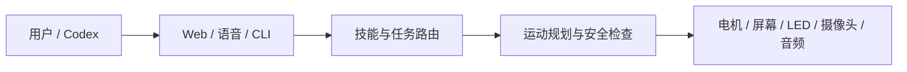

# YareLampGo

简体中文 | [English](README.en.md)

> 一盏能听、能看、会动、还会用表情回应你的开源桌面 AI 机械臂台灯。

[](LICENSE)
[](https://www.python.org/downloads/)
[](https://github.com/astral-sh/uv)

<p align="center">
  
  
</p>
<p align="center"><sub>V2.0 时间模式 · V2.0 海浪模式</sub></p>

YareLampGo 把电机、屏幕、RGB LED、摄像头、麦克风和大模型装进一盏台灯里。你可以在网页上控制它，也可以直接对它说话，或者让 Codex 帮你装机、排查问题和完成复杂任务。

## 它能做什么

- **会动，也会表达。** 5 自由度机械臂、动态眼睛和 RGB 点阵灯会一起回应，不是只会亮灯的普通台灯。
- **能看周围。** 摄像头可以拍照、巡看、找目标、检测人脸或有人出现；逗猫模式还能追踪彩色标记。
- **能听会说。** 支持语音识别、`Hi,小星` 唤醒、语音播报和实时语音对话。
- **表情可以自己做。** 网页里能直接画 51×9 LED 表情、上传眼睛动画；AI 也能按安全格式生成表情素材。
- **能把复杂任务交给 Codex。** 普通对话快速处理，复杂任务可转交本机 Codex；Codex 也能读取状态、看摄像头和调用台灯动作。
- **非技术用户也能玩。** 浏览器里就能聊天、控制动作、画表情、录制动作和改设置。
- **软件、固件、接线资料和 V2 结构总成已开源。** 支持二创和魔改；结构可自行拆分后 3D 打印。

## 有 Codex？直接让它带你装

仓库自带 `$lampgo-setup` skill。它不是再丢给你一篇安装文档，而是会根据你手上的东西，一步步检查并执行安装。

macOS / Linux：

```bash
git clone https://github.com/ninsmiracle/YareLampGo.git
cd YareLampGo
./install-codex-skill.sh
```

Windows PowerShell：

```powershell
git clone https://github.com/ninsmiracle/YareLampGo.git
Set-Location YareLampGo
powershell -ExecutionPolicy Bypass -File .\install-codex-skill.ps1
```

然后新建一个 Codex 任务，直接说：

```text
用 $lampgo-setup 帮我安装和配置 YareLampGo V2.0
```

Skill 会自动判断你是“先体验软件”“已有成品机”还是“从零 DIY”。能安全执行的步骤它会直接做；写舵机 ID、烧录固件、首次接通 12V、校准和第一次真实运动前，它会停下来让你确认。中文用户默认全程中文。

详细说明见 [Codex 集成](docs/guides/codex-integration.md)。

## 不用 Codex？也可以手动安装

不用 Codex，也可以完整手动安装。DIY 用户需要依次完成：安装软件 → 给五颗舵机写入 ID 1～5 → 烧录 S3/C6 → 断电组装和检查供电 → 扫描舵机 → 校准 → 配网并启动。

完整命令、安全检查和 Windows/macOS/Linux 说明见 [V2.0 手动安装、烧录与首次启动](docs/getting-started/manual-hardware-setup.md)。固件烧录以独立的 [YareLampGo_esp32](https://github.com/shelly-tang/YareLampGo_esp32) 仓库为准。

## 只想先看看软件

没有硬件也能运行 Web 控制台：

```bash
./install.sh
uv run lampgo onboard
uv run lampgo run --web --no-hw
```

浏览器打开 <http://127.0.0.1:8420>。Windows 安装命令和真实硬件装机步骤见 [快速上手](docs/getting-started/quick-start.md)。

## 常用命令

```bash
uv run lampgo help                 # 查看 CLI 说明和可复制示例
uv run lampgo detect               # 发现串口、摄像头和 ESP32
uv run lampgo scan-motors --ids 1-5
uv run lampgo calibrate            # 交互式校准 5 个关节
uv run lampgo run --web            # 启动真实台灯和 Web 控制台
uv run lampgo run --web --no-hw    # 无硬件体验
uv run lampgo status               # 查看正在运行的服务
uv run lampgo clear                # 结束残留进程并释放电机扭矩
```

更多参数：`uv run lampgo <command> --help`。

## 复刻 V2.0

V2.0 已直接替换 V1.0，请不要混用两代结构件、接线图或校准文件。

| 你需要的资料 | 入口 |
| --- | --- |
| V2 硬件、组装和首次上电 | [V2.0 硬件与组装](docs/hardware/v2/README.md) |
| 电源、S3/C6、功放、LED 和舵机接线 | [V2.0 接线表](docs/hardware/wiring.md) |
| 完整 STEP 总成 | [V2.0 结构件](assets/printable/README.md) |
| GitHub 网页版图文组装说明 | [组装说明 Markdown](docs/hardware/v2/YareLampGo_V2.0_assembly_manual.md) |
| 原始图文组装说明 | [组装 DOCX 下载](docs/hardware/v2/YareLampGo_V2.0_assembly_manual.docx) |
| S3/C6 固件 | [YareLampGo_esp32](https://github.com/shelly-tang/YareLampGo_esp32) |

当前公开的是完整 STEP 总成，不是已经拆好的逐件 STL/3MF；电路 PNG 也是接线和走线参考，不是可以直接交给板厂的 Gerber 制板包。

## 现在可以玩什么

| 玩法 | 它会做什么 |
| --- | --- |
| [时间模式](docs/images/readme/lampgo_v2_time_mode.gif) | 点阵屏显示时间，顶部屏幕同步显示眼睛表情。 |
| [海浪模式](docs/images/readme/lampgo_v2_wave_mode.gif) | 灯头左右摆动，灯光和眼睛跟着联动。 |
| 逗猫模式 | 摄像头追踪逗猫棒上的彩色标记，根据标记附近的动作做出追踪、停顿和撤离。 |
| 音乐律动 | macOS 上可以跟随系统音频做动作。 |
| 自定义玩法 | 手动录制动作，再把动作、表情、灯光和语音组合成自己的 skill。 |

时钟、海浪和逗猫是已有能力；无声提醒、欢迎回家等场景可以继续用组合 skill 扩展。

## Codex 不只负责安装

启动 LampGo 后，它会自动发现本机 Codex 并注册 MCP 工具，不需要手动填 token 或端口：

```bash
uv run lampgo run --web
```

- 可以直接说“把 Codex 叫来”，把当前任务交给本机 Codex。
- Codex 可以读取台灯状态、调用安全动作、抓取摄像头画面或向你提问。
- LampGo 可以参考 Codex 的记忆摘要，也能在确认后导入 Agent 的资料和核心记忆。
- 其他 Agent 可以通过 CLI、HTTP / WebSocket API 或技能层继续接入。

## 它怎么工作



真实动作都会经过 `MotionRuntime` 和 `SafetyKernel`，再写入电机。架构细节见 [系统架构](docs/architecture.md)。

## 文档

| 想做什么 | 看这里 |
| --- | --- |
| 第一次运行 | [快速上手](docs/getting-started/quick-start.md) |
| 手动安装、烧录、舵机编号和首次上电 | [V2.0 手动安装](docs/getting-started/manual-hardware-setup.md) |
| 修改模型、语音、摄像头和设备配置 | [配置说明](docs/getting-started/configuration.md) |
| 做动作、表情和组合玩法 | [动作与表情](docs/guides/motion-and-expression.md) · [组合技能](docs/composed_skills.md) |
| 接入 Codex | [Codex 集成](docs/guides/codex-integration.md) |
| 了解项目代码 | [系统架构](docs/architecture.md) · [项目说明](docs/project_description.md) |
| 参与开发 | [贡献指南](docs/development/contributing.md) |

## 参与贡献

欢迎分享动作录制、表情、组合 skill、硬件改造和真实使用案例。一个 PR 尽量只做一件事；涉及真实硬件时，请说明使用的设备、校准、动作结果和是否测试过 `--no-hw`。

YareLampGo 是独立项目。电机控制链路使用 `lerobot[feetech]`，少量 HAL 集成工作受 LeLamp 启发，具体归属见 [NOTICE](NOTICE)。

## License

软件代码使用 [GPL-3.0-only](LICENSE)。作者与归属见 [AUTHORS.md](AUTHORS.md)、[COPYRIGHT](COPYRIGHT) 和 [NOTICE](NOTICE)。

硬件、结构、3D 模型、演示 GIF 和其他资产的许可单独列在 [ASSET_LICENSES.md](ASSET_LICENSES.md)。生产 CAD、供应商图纸、报价和工艺文件不在公开范围内，除非文件被明确列入资产许可表。
