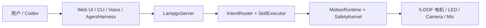

# YareLampGo

简体中文 | [English](README.en.md)

> 把机械臂台灯变成普通人也能玩起来的桌面小伙伴：能听你说话，能看见环境，能自己动起来，还会用动作和表情回应你。

[](LICENSE)
[](https://www.python.org/downloads/)
[](https://github.com/astral-sh/uv)

<p align="center">
  
</p>

YareLampGo 的目标：
降低机械臂和具身智能的使用门槛，让没有技术背景的普通人也可以玩起来。
过去这种机械臂更像实验室设备，非技术背景的普通人很难上手；
YareLampGo 把电机、灯光、摄像头、麦克风和大模型接成一个本地软件系统，让开发者、创作者和普通玩家可以用网页、命令行、自然语言或 AI Agent 快速做出有趣的桌面互动。

仓库内的 `lampgo` 仍作为 **YareLampGo** 项目的内部简称，用于简化 Python 包名、CLI 命令和配置目录。

项目默认提供本地 Web 控制台、CLI、HTTP / WebSocket 接口和零配置 Codex 接入，也支持无硬件模式。你可以先把软件玩法跑通，再接真实设备。

<a id="highlights"></a>

## 主要亮点

- **自然语言控制真实台灯**：一句“点个头”“看向我”“做个害羞表情”，就能触发动作、灯光、语音和 Agent 行动。
- **Web 控制台开箱可用**：浏览器里完成聊天、动作播放、动作录制、表情切换、设备状态和配置管理。
- **复刻主线完整**：依赖安装、舵机编号、S3/C6 烧录、整机组装、串口探测、校准和 Web 启动都有明确入口。
- **动作可以录制和复用**：手动摆动台灯录制参数文件，之后可以通过 Web、CLI、自然语言或 Codex 再次调用。
- **非技术用户也能扩展玩法**：可以用自然语言描述“欢迎回家”“被夸后害羞一下”这类场景，新增自己的原子动作或组合动作，并沉淀成适合自己的桌面 skill。
- **Codex 可以调用真实硬件**：LampGo 自动注册本机 MCP 工具，让 Codex 读取状态、控制关节、抓取摄像头画面并向用户确认。
- **无硬件也能先开发**：没有真实台灯时使用 `--no-hw`，仍然可以调 Web UI、配置、技能、路由和 Agent 流程。


<a id="who-is-it-for"></a>

## 适合谁

- **普通软件开发者**：想做真实硬件互动，但不想从电机控制和串口协议开始学。
- **自媒体和内容创作者**：想让桌面设备会动、会回应、会表演，做出更有记忆点的视频或直播互动。
- **AI 硬件原型团队**：想快速验证桌面机械臂、智能台灯和具身 AI 的新场景。
- **Agent 应用团队**：想让 Agent 不只操作网页和文件，也能调用真实电机、灯光、摄像头和语音。

<a id="quick-start"></a>

## 复刻主线：从源码到成品

DIY 复刻请严格按下面的顺序完成：

**安装依赖 → 舵机编号 → 烧录 S3/C6 → 整机组装 → 探测与校准 → 启动 Web**

如果你拿到的是已经完成舵机编号、固件烧录和组装的成品，可以直接从第 5 步开始。

### 1. 获取源码并安装全部依赖

```bash
git clone https://github.com/ninsmiracle/YareLampGo.git
cd YareLampGo
```

macOS / Linux：

```bash
./install.sh
```

Windows PowerShell：

```powershell
powershell -ExecutionPolicy Bypass -File .\install.ps1
```

安装器会自动识别系统和 CPU、准备 `uv` 与 Python 3.12，并由 `uv` 按 `uv.lock` 安装包括 LiveKit 语音 SDK 在内的全部运行依赖。失败时终端会显示具体阶段，完整日志保存在 `~/.lampgo/logs/`。当前完整依赖矩阵支持 macOS 14+ Apple Silicon、Windows x64 和常见 glibc Linux；Windows 的依赖安装已覆盖，但 LampGo 运行时的 IPC 与进程管理仍在适配中。

### 2. 给五颗舵机编号（组装前必做）

新买的 Feetech STS3215 舵机可能使用相同的出厂 ID，不能直接全部串到同一条总线上。请在安装进结构件之前，通过舵机驱动板一次只连接一颗舵机，然后运行：

```bash
uv run lampgo setup-motors
```

如果自动探测到多个串口，请显式指定舵机驱动板端口：

```bash
# macOS 示例
uv run lampgo setup-motors --port /dev/cu.usbmodemXXXX

# Linux 示例
uv run lampgo setup-motors --port /dev/ttyACM0
```

Windows PowerShell 使用同一个命令，把端口替换成实际的 `COM` 口：

```powershell
uv run lampgo setup-motors --port COM5
```

默认编号如下；如果你修改过 `~/.lampgo/config.toml` 的 `device.motors`，以实际配置为准。

| 安装位置 | 程序名称 | 目标 ID |
| --- | --- | ---: |
| 底座水平旋转 | `base_yaw` | 1 |
| 底座俯仰 | `base_pitch` | 2 |
| 肘部俯仰 | `elbow_pitch` | 3 |
| 手腕滚转 | `wrist_roll` | 4 |
| 手腕俯仰 | `wrist_pitch` | 5 |

程序会按上表逐颗提示。每次提示后：关闭 12V 舵机电源，只接入对应的一颗舵机，重新上电，再按回车。显示成功后先断电，再更换下一颗。这个命令会实际写入舵机的持久化 ID，并把总线波特率统一为 `1,000,000`；它不是只修改软件配置。

> **关键安全要求：按回车时总线上只能有一颗舵机。** 多颗未编号或重复 ID 的舵机同时连接，可能导致编号写到错误的舵机。换插舵机线前必须先关闭 12V 电源。

### 3. 分别烧录 S3 和 C6

固件位于独立仓库 [YareLampGo_esp32](https://github.com/shelly-tang/YareLampGo_esp32)。S3 负责摄像头、麦克风、扬声器、LED、网络和上位机通信；C6 负责 LCD 眼睛显示。建议在组装前分别用 USB 烧录并确认能够启动。

先获取固件源码：

```bash
cd ..
git clone https://github.com/shelly-tang/YareLampGo_esp32.git
cd YareLampGo_esp32
```

烧录 XIAO ESP32-S3（首次烧录保留 `--erase`）：

```bash
./scripts/flash.sh --list-ports
./scripts/flash.sh --port /dev/cu.usbmodemXXXX --erase --monitor
```

烧录 8MB ESP32-C6 LCD 板；C6 的端口通常和 S3 不同：

```bash
arduino-cli compile --upload \
  --port /dev/cu.usbmodemYYYY \
  --fqbn esp32:esp32:esp32c6:FlashSize=8M \
  ESP32_C6_LCD_1_47_UART
```

Windows 请在 Arduino IDE 中选择对应开发板和 `COM` 口进行烧录。S3 的预编译包、无 Arduino 烧录方式、BOOT/RESET 救援步骤见[固件烧录指南](https://github.com/shelly-tang/YareLampGo_esp32/blob/main/README.zh-CN.md)，C6 的 8MB 分区要求见 [C6 固件说明](https://github.com/shelly-tang/YareLampGo_esp32/blob/main/ESP32_C6_LCD_1_47_UART/README.md)。

### 4. 断电组装整机

两块控制板和五颗舵机都准备好以后，再完成机械结构和整机接线：

1. 断开 12V 主电源和两块控制板的 USB。
2. 按第 2 步的 ID/关节对应关系安装五颗舵机，保证线束不会进入齿轮、转轴和夹点。
3. 按[公开接线表](docs/hardware/wiring.md)连接舵机总线、5V 降压、S3、麦克风、功放、扬声器和 LED，并确保所有低压模块共地。
4. 连接显示串口：S3 GPIO43 TX → C6 GPIO17 RX、S3 GPIO44 RX ← C6 GPIO16 TX，并连接 GND。
5. 对照[结构件文件和预览](assets/printable/README.md)装好底座、连杆、灯头和盖板，检查所有插头、螺丝及活动范围。

到这里才算完成硬件成品。首次上电时先扶稳机构、保持关节远离机械限位，并随时准备断开 12V 主电源。

### 5. 探测串口、检查电机并校准

整机上电后回到 `YareLampGo` 软件仓库，先探测端口和五颗舵机，再进行校准：

```bash
cd ../YareLampGo
uv run lampgo detect
uv run lampgo scan-motors --ids 1-5
uv run lampgo ping
uv run lampgo calibrate
```

正常结果应能看到 ID 1～5 全部在线。若电脑连接了多个串口，给 `scan-motors`、`ping` 和 `calibrate` 增加 `--port <舵机端口>`。首次连接、换过舵机、重装结构件或更换控制板后，都必须重新校准，再运行大幅动作。

### 6. 完成首次配置并启动 Web

首次使用先运行配置向导，然后启动 Web 控制台：

```bash
uv run lampgo onboard
uv run lampgo run --web
```

打开 <http://127.0.0.1:8420>，即可使用聊天、动作、录制、表情和设置面板。配置向导会检查环境、保存硬件串口、模型凭证和人设文件，并自动发现已登录的本机 Codex；敏感凭证保存在 `~/.lampgo/credentials.json`。

S3 首次烧录或执行过 `--erase` 后，还需要在 Web 配置页完成 Wi-Fi 配网：连接设备热点 `Lampgo-Setup-XXXX`（默认密码 `lampgo123`），再选择和电脑相同的 2.4GHz Wi-Fi，等待设备回连。

| 连接设备热点 | 选择 2.4GHz Wi-Fi | 等待设备回连 |
| --- | --- | --- |
|  |  |  |

没有硬件时可以先启动纯软件模式：

```bash
uv run lampgo run --web --no-hw
```

<a id="macos-music-mode-permission"></a>

### macOS 音乐律动权限

`uv run lampgo onboard` 会自动准备音乐律动需要的系统音频组件。首次使用“音乐律动”时，macOS 会请求“屏幕录制/屏幕与系统音频录制”权限；允许后请重启 YareLampGo 再进入音乐律动。

<a id="common-commands"></a>

## 常用玩法

```bash
uv run lampgo help                         # 查看常用调试命令
uv run lampgo status                       # 查询守护进程状态
uv run lampgo detect                       # 自动探测串口
uv run lampgo setup-motors                 # 组装前逐颗写入舵机 ID
uv run lampgo scan-motors --ids 1-20       # 电机总线原始扫描
uv run lampgo skills                       # 列出可用技能

uv run lampgo text "做个害羞的表情"          # 自然语言路由
uv run lampgo invoke dance                 # 调用内置技能
uv run lampgo invoke cat_teaser marker_color=red duration=60      # 逗猫棒互动
uv run lampgo move base_yaw=30             # 直接移动指定关节
uv run lampgo play shy                     # 回放录制动作
uv run lampgo record my_action --fps 30    # 手动录制新动作

uv run lampgo calibrate                    # 交互式电机校准
uv run lampgo estop                        # 紧急停止
uv run lampgo clear                        # 清理进程并释放串口
```

更多步骤见 [快速上手](docs/getting-started/quick-start.md)。

### 动作演示

| 爱心回应 | 眨眼互动 |
| --- | --- |
|  |  |

<a id="architecture-at-a-glance"></a>

## 架构一眼看懂



所有动作最终都会经过 `MotionRuntime` 和 `SafetyKernel`，再写入真实硬件。更完整的模块说明见 [系统架构](docs/architecture.md)。

<a id="positioning-and-boundary"></a>

## 项目定位与边界

YareLampGo 现在先做一件事：把桌面机械臂台灯变成一个好启动、好调试、好扩展的硬件入口。它不是 VLA / RL 论文复现仓库，也没有内置复杂训练流程。我们欢迎社区把数据采集、模仿学习、VLA、RL 或更严肃的机器人算法接进来；现有 Web、CLI、动作录制和硬件接口，就是给这些扩展留的。
YareLampGo 是独立项目。电机控制链路用到 `lerobot[feetech]`，少量 HAL 集成工作受 LeLamp 启发；更具体的归属和许可边界见 [NOTICE](NOTICE)。
后面我们也想把“灯头”做得更像可替换组件：磁吸或卡扣结构，头部不一定只能是灯，也可以是手机支架、小音箱，或者更多有意思的模块。更完整的想法放在 [未来方向](docs/roadmap.md)，也欢迎大家来一起玩儿，提供更多有意思的想法。

<a id="documentation"></a>

## 文档

| 分类 | 文档 |
| --- | --- |
| 入门 | [文档中心](docs/README.md)、[快速上手](docs/getting-started/quick-start.md)、[配置说明](docs/getting-started/configuration.md) |
| 使用指南 | [动作与表情](docs/guides/motion-and-expression.md)、[Codex 集成](docs/guides/codex-integration.md) |
| 硬件 | [硬件公开资料](docs/hardware/README.md)、[接线表](docs/hardware/wiring.md)、[结构件文件](assets/printable/README.md) |
| 架构 | [系统架构](docs/architecture.md)、[项目说明](docs/project_description.md)、[未来方向](docs/roadmap.md) |
| 开发 | [贡献指南](docs/development/contributing.md)、[示例代码](examples/) |

<a id="codex-integration"></a>

## Codex 集成

Codex 已安装并登录时，启动 LampGo 会自动发现 CLI、注册 stdio MCP，并显示“Codex 已接通”。复杂任务由本机 Codex 执行，Codex 也能通过受控工具读取台灯状态、执行动作、抓取摄像头画面或向用户提问。

```bash
uv run lampgo run --web
```

不需要配置 token、端口或环境变量。集成细节见 [Codex 集成指南](docs/guides/codex-integration.md)。

<a id="contributing"></a>

## 参与贡献

欢迎把你做出的动作、桌面互动 case、组合 skill 场景、Codex 玩法、硬件适配和文档经验共享回本仓库。可以从这些入口开始：

- 动作资产：录制后整理为 `assets/recordings/` 下的 CSV，并补一份简短说明。
- 使用案例和脚本：放到 `examples/` 或文档中，说明适合什么场景。
- 组合 skill 场景：参考 `docs/examples/` 和 [组合技能](docs/composed_skills.md)，尽量写清触发方式、动作步骤和安全边界。

最简贡献流程：

```bash
./install.sh --dev
uv run ruff check lampgo tests
uv run pytest
```

一个 PR 聚焦一个主题。涉及硬件或动作时，请说明测试设备、串口、校准文件、动作效果和是否覆盖 `--no-hw` 模式。更多细节见 [贡献指南](docs/development/contributing.md)。

## License

本仓库的软件代码基于 [GNU General Public License v3.0 only](LICENSE) 开源。作者与归属信息见 [AUTHORS.md](AUTHORS.md)、[COPYRIGHT](COPYRIGHT) 和 [NOTICE](NOTICE)。

硬件、外观、运行时 3D 模型和 3D 打印资料不默认跟随主软件许可证；资产授权见 [ASSET_LICENSES.md](ASSET_LICENSES.md)。
当前 GLB 作为 Web 可视化资产使用 CC-BY-NC-SA-4.0，允许非商用展示、分享和改造；公开的社区复刻/可打印外观结构件位于 [assets/printable/](assets/printable/README.md)，包括 V1.0 STEP/STP 文件和预览图，默认使用 CERN-OHL-W-2.0。
生产 CAD、供应商生产图纸、报价和工艺文件不包含在公开仓库中，除非文件被明确列入资产授权表或本地许可说明。
