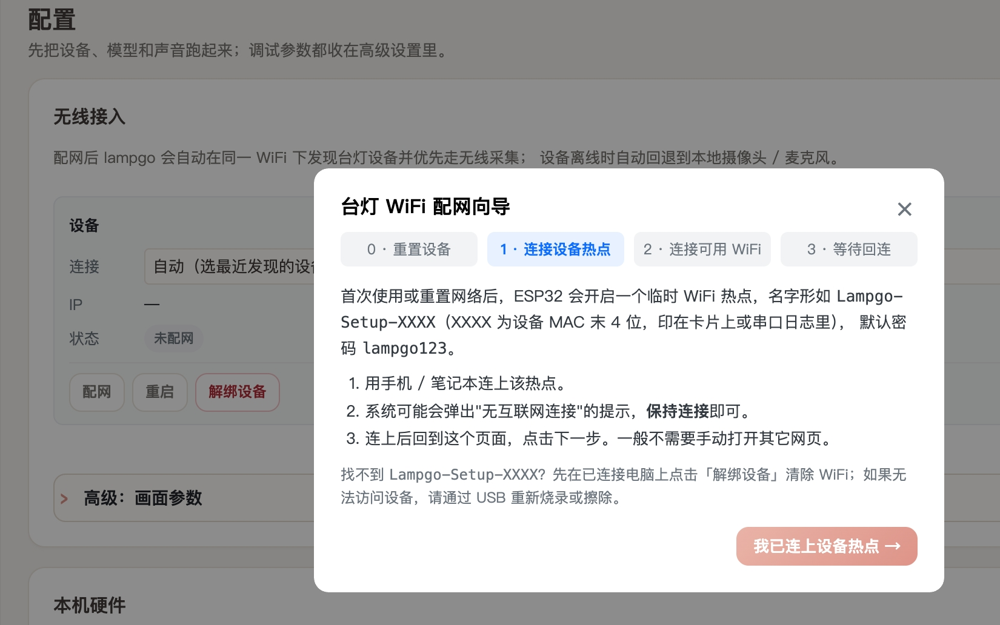
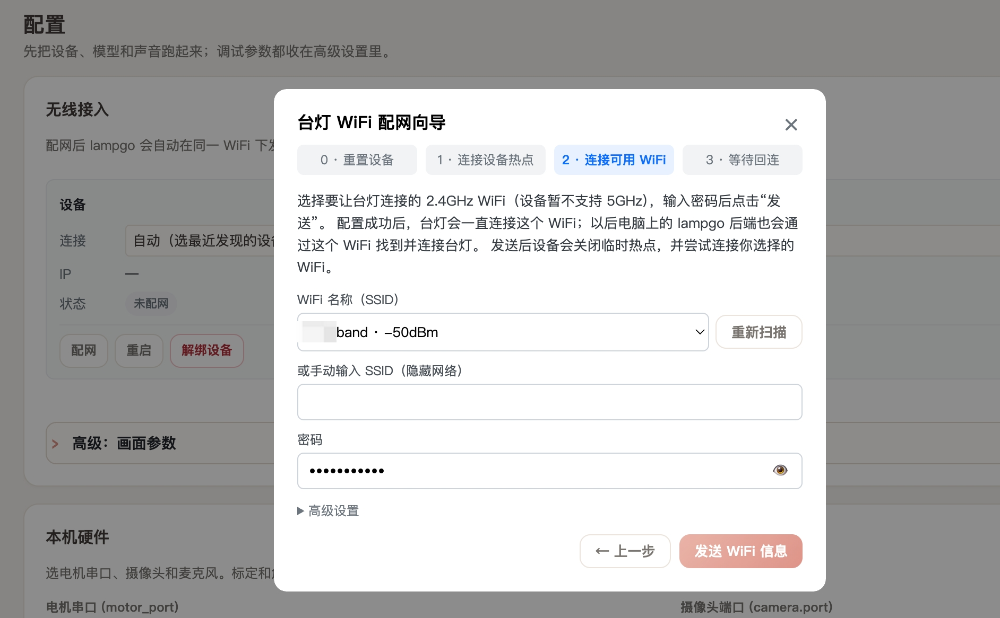
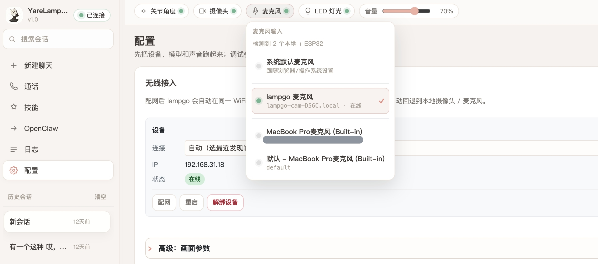

# 快速上手

本文面向第一次运行 YareLampGo 的用户，目标是在几分钟内启动本地 Web 控制台，并确认软件链路或真实硬件链路可用。命令行入口仍使用 `lampgo`。

## 环境要求

- Python 3.12+
- `uv`（一键安装器会自动准备）
- macOS、Linux 或 Windows
- 可选硬件：兼容的 5-DOF Feetech 机械臂台灯、ESP32 LED 控制器、摄像头、麦克风

Python 由 `uv` 自动管理，通常不需要手工创建虚拟环境。

## 获取代码

```bash
git clone https://github.com/ninsmiracle/YareLampGo.git
cd YareLampGo
```

## 一键安装全部依赖

macOS / Linux：

```bash
./install.sh
```

Windows PowerShell：

```powershell
powershell -ExecutionPolicy Bypass -File .\install.ps1
```

安装器自动完成平台与 CPU 检查、已验证 `uv` 版本和 Python 3.12 准备、Linux PortAudio/源码构建工具安装、锁定的 Python 依赖同步，以及 LiveKit SDK import/CLI 验证。Python 包全部由 `uv sync --locked` 管理，不会混用系统 `pip`。SDK 使用公网 PyPI 的 `lampgo-livekit-agent-sdk`，不需要连接小米内网。

安装输出会实时显示在终端，同时写入 `~/.lampgo/logs/install-*.log`。失败后请保留终端最后的“失败阶段”和日志文件；修复网络、权限或系统版本问题后直接重跑同一命令即可，`uv` 会复用已下载缓存。

当前完整依赖矩阵：

| 平台 | 安装状态 | 说明 |
| --- | --- | --- |
| macOS 14+ Apple Silicon | 支持 | 包含预编译系统音频组件。 |
| Windows x64 | 支持依赖安装 | LampGo 运行时的 Unix IPC、信号和进程组逻辑仍在适配。 |
| 常见 glibc Linux x64 / ARM64 | 支持 | 自动识别 apt、dnf、yum、zypper 或 pacman 安装 PortAudio。 |
| Intel Mac / Windows ARM64 | 暂不支持 | 当前锁定的原生 wheel 不完整，安装器会提前给出明确提示。 |

如果只想先调试 Web、配置和 Agent 链路，可以不连接硬件。

## 首次配置

```bash
uv run lampgo onboard
```

向导会依次处理：

| 步骤 | 说明 |
| --- | --- |
| `env_check` | 检查 Python、`uv` 和关键依赖。 |
| `hardware` | 配置电机串口、摄像头、麦克风和 ESP32 无线设备，支持自动探测。 |
| `llm` | 配置 LLM provider、模型、Base URL 和 API key。 |
| `persona_memory` | 导入默认或自定义人设与记忆文件。 |
| `codex` | 自动发现本机 Codex、检查登录并注册 LampGo MCP 工具。 |

配置默认写入：

```text
~/.lampgo/
├── config.toml
├── credentials.json
├── memory/
└── <persona>.md
```

`credentials.json` 保存敏感凭证，请勿提交到仓库。

## 启动 Web 控制台

连接真实硬件：

```bash
uv run lampgo run --web
```

无硬件模式：

```bash
uv run lampgo run --web --no-hw
```

指定端口：

```bash
uv run lampgo run --web --web-port 18790
```

打开 <http://127.0.0.1:8420> 后，可以使用聊天、技能、表情、录制和设置面板。

## 验证安装

另开一个终端执行：

```bash
uv run lampgo status
uv run lampgo skills
uv run lampgo text "点个头"
```

如果没有启动守护进程，`status` 和 `text` 会提示先运行 `lampgo run`。硬件未连接时，运动和 LED 技能会自动跳过真实写入，但 Web 与路由仍可调试。

## 连接真实硬件

### 硬件配网

首次使用 ESP32 LED 控制器、摄像头或麦克风时，需要先把硬件接入和电脑相同的局域网。设备暂不支持 5GHz Wi-Fi，建议准备 2.4GHz Wi-Fi，并确认电脑和硬件在配网过程中距离路由器较近。

1. 给硬件通电，等待设备进入配网模式。如果是干净烧录或已清空旧 Wi-Fi，串口日志会出现 `SSID: Lampgo-Setup-XXXX`。
2. 在电脑的 Wi-Fi 列表中找到 `Lampgo-Setup-XXXX` 设备热点，输入热点密码 `lampgo123` 并保持连接。系统如果提示“无互联网连接”，选择继续连接即可。
3. 打开 YareLampGo Web 控制台，进入设置页的 ESP32 / 无线设备配网向导，点击“我已连上设备热点”。
4. 在配网向导中选择要让台灯连接的 2.4GHz Wi-Fi，输入该 Wi-Fi 的密码，然后点击发送。
5. 发送成功后等待设备重启。设备会关闭临时热点并连接目标 Wi-Fi，此时把电脑切回同一个 2.4GHz Wi-Fi。
6. 等待 Web 控制台重新发现 `lampgo-cam-XXXX.local` 或设备 IP 后，再继续执行下面的软件配置步骤。

| 连接设备热点 | 选择 2.4GHz Wi-Fi | 等待设备回连 |
| --- | --- | --- |
|  |  |  |

> 自动扫描失败时，可检查高级设置里的设备配网页地址是否为 `http://192.168.4.1`。

### 接入 YareLampGo

1. 接入电机总线。
2. 执行 `uv run lampgo detect` 查看候选串口和网络设备。
3. 执行 `uv run lampgo onboard` 或在 Web 设置页写入串口和 ESP32 设备信息。
4. 首次使用新设备时执行 `uv run lampgo calibrate`。
5. 启动 `uv run lampgo run --web`。

常见调试命令：

```bash
uv run lampgo ping
uv run lampgo invoke return_safe
uv run lampgo invoke set_expression expression=heart
uv run lampgo estop
uv run lampgo clear
```

## 下一步

- 阅读 [配置说明](configuration.md) 理解配置来源和凭证管理。
- 阅读 [动作与表情](../guides/motion-and-expression.md) 学习录制、回放和 LED 控制。
- 阅读 [Codex 集成](../guides/codex-integration.md) 将台灯接入本机复杂任务工作流。
