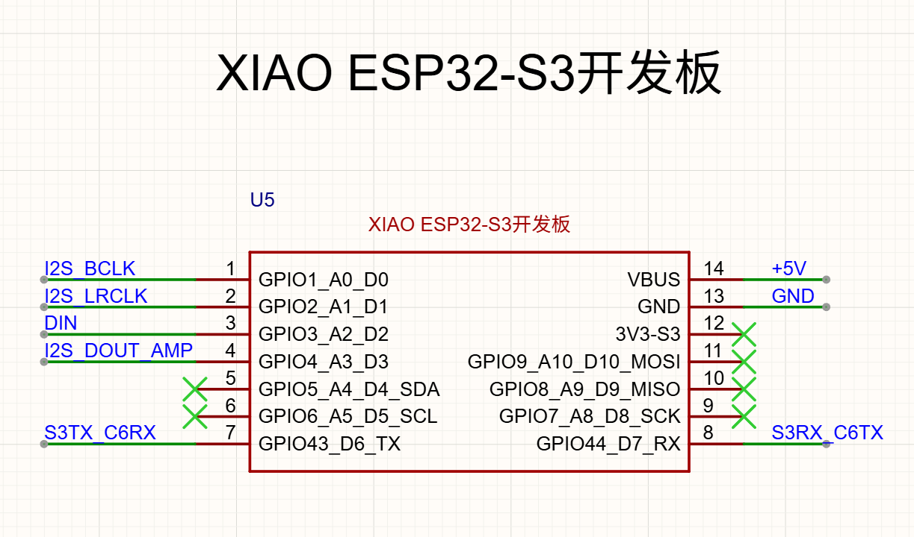
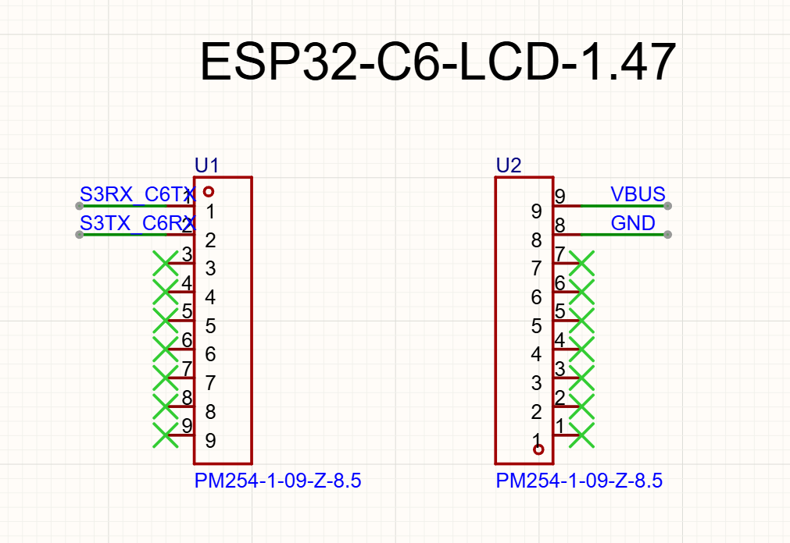
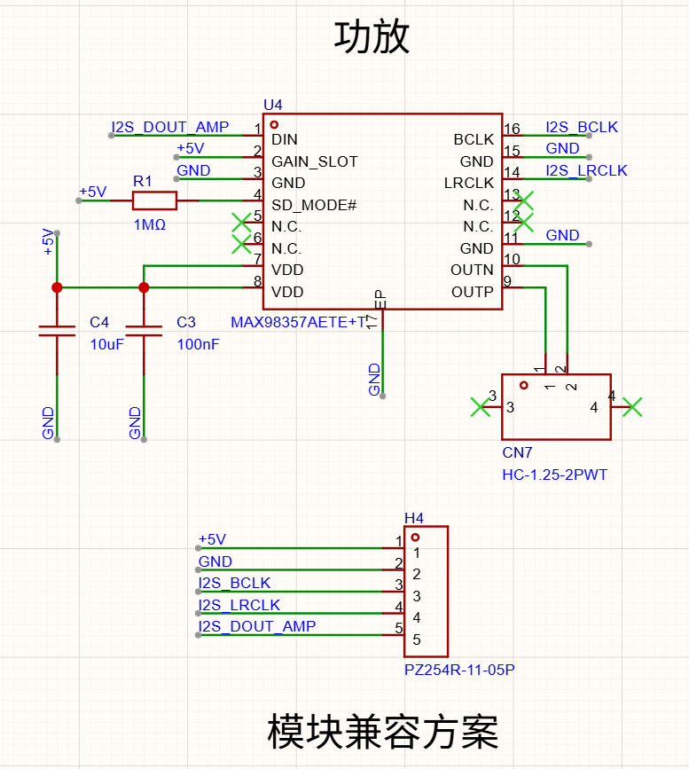
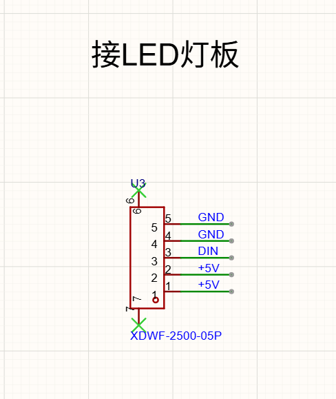
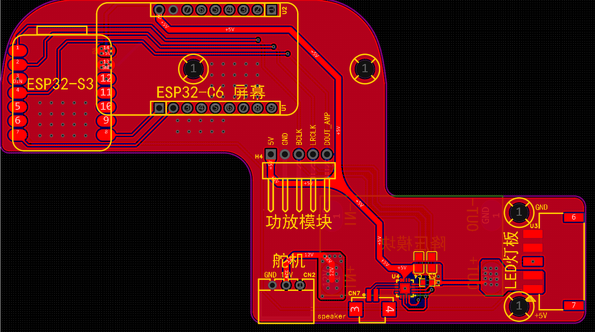
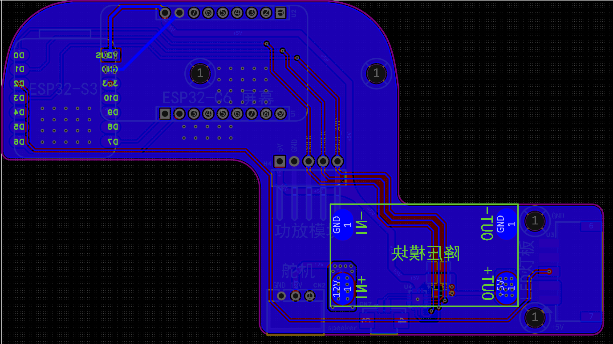

# YareLampGo V2.0 硬件与组装

简体中文 | [English](README.en.md)

V2.0 是当前公开硬件和机械结构的唯一维护版本。由于 V1.0 用户量很小，本次直接替换旧结构和接线入口，不提供 V1/V2 混装兼容方案。


## 这次发布包含什么

| 资料 | 用途 |
| --- | --- |
| [手动安装、烧录与首次启动](../../getting-started/manual-hardware-setup.md) | 从舵机编号、S3/C6 烧录到校准和 Web 启动的完整命令流程。 |
| [完整 STEP 总成](../../../assets/printable/YareLampGo_V2.0/YareLampGo_V2.0_assembly.step) | 查看结构、装配关系和采购件占位；单位为毫米。 |
| [组装说明 DOCX](YareLampGo_V2.0_assembly_manual.docx) | 查看物料图片、嵌件/螺钉位置、走线与装配过程。 |
| [当前接线指南](../wiring.md) | 可搜索的电源域、S3/C6、音频、LED 和舵机接线表。 |
| [`schematics/`](schematics/) | 4 张原理/接口图和 2 张 PCB 顶/底层参考图。 |
| [源文件清单](SOURCE_MANIFEST.md) | 原始文件名、SHA-256、STEP/DOCX/GIF 检查结果和发布边界。 |

## 当前 V2.0 实机展示

<p align="center">
  
  
</p>

- **时间模式：** 前置点阵屏显示时间，顶部 C6 屏显示眼睛表情，用于展示当前显示链路和 V2.0 整机外观。
- **海浪模式：** 灯头左右摆动，前置灯带显示蓝色光带，用于展示校准后关节动作与灯光/表情联动。

这两段 GIF 是当前 V2.0 实机展示，不是时钟精度、关节全行程、长时间运行稳定性或电气安全测试报告。其他设备复现动作前仍需完成本机舵机扫描、校准和运动空间确认。

## V2.0 架构

- 主控：Seeed Studio XIAO ESP32-S3 Sense，负责摄像头、音频、LED、网络和上位机通信。
- 屏幕：ESP32-C6-LCD-1.47，通过 UART 与 S3 互联。
- 运动：5 颗 STS3215 总线舵机，仍使用 ID 1～5。
- 音频：MAX98357A 板载方案，并保留 H4 五针功放模块兼容接口；CN7 接喇叭。
- 灯板：U3 五针接口，包含两组 +5V/GND 和一根 `DIN`。
- 供电：舵机侧为 12V，S3/C6/功放/LED 为 +5V，全部共地。

## 电路图说明

### 1. XIAO ESP32-S3 引脚



关键网络：GPIO1 为 I2S BCLK，GPIO2 为 I2S LRCLK，GPIO3 为 LED `DIN`，GPIO4 为功放 I2S 数据，GPIO43/44 为 C6 UART TX/RX。VBUS 接 +5V。

### 2. ESP32-C6 LCD 排针



U1 的前两针承载 S3/C6 交叉 UART；U2 的 9/8 针为 VBUS/GND。图中其余针位标记为不连接。排针网络名表达方向：`S3TX_C6RX` 是 S3 发给 C6，`S3RX_C6TX` 是 C6 发给 S3。

### 3. MAX98357A 功放



板载 MAX98357A 使用 +5V、BCLK、LRCLK 和 `I2S_DOUT_AMP`。`SD_MODE#` 由 1 MΩ 上拉，OUTP/OUTN 以桥接方式驱动 CN7 喇叭。H4 复用相同五个网络，用于兼容现成功放模块；不要同时装两套相互冲突的输出路径。

### 4. LED 灯板接口



U3 从 5 到 1 依次为 GND、GND、DIN、+5V、+5V。此图没有定义线束插头的观察方向，压线和插接前必须对照 PCB 丝印和万用表，不要仅凭线色判断。

### 5. 主板顶层



顶层图显示 S3、C6、功放模块兼容位、板载功放/喇叭、舵机、电源模块和 LED 灯板接口的相对位置。它适合做装配与连通性复核，不等同于完整制板输出。

### 6. 主板底层



底层图用于核对底层走线、铜皮和贯穿连接。与顶层图一样，它缺少钻孔、层叠、阻焊/钢网和生产说明，不能直接交给板厂。

## 建议装配顺序

1. **先编号舵机。** 一次只连接一颗舵机，按 `base_yaw` 到 `wrist_pitch` 写入 ID 1～5；每次换线都先断 12V。
2. **准备紧固件和嵌件。** 原说明使用 M2.5 热熔铜螺母/嵌件、M2.5 紧固件、M3 关节紧固件和部分自攻螺钉。采购前在 STEP/DOCX 中复核长度与数量。
3. **装五个舵机外壳。** 舵机线留在壳体内部指定通道，三个中段舵机的线缆朝向保持一致，避免壳体夹线。
4. **装底座电子件。** 断开 12V 和 USB，安装电源模块、底座舵机、控制板和固定件；先走线，再合上底盖/上盖。
5. **装支撑杆。** 使用 M3 紧固关节，把线束穿过支撑杆走线孔；转动全行程检查是否拉扯或磨线。
6. **装灯头。** 先固定 LED 灯板及四个固定块，再装外圈、控制板、C6 屏幕/盖板、喇叭和灯头外壳。
7. **静态验收。** 逐个检查嵌件、螺钉、插头方向、活动间隙和线束夹点，再进行首次上电。

> DOCX 中物料表的大部分名称仍嵌在图片内，且没有给出全部紧固件长度。它是装配参考，不是可以不经复核直接采购的量产 BOM。

## 首次上电与软件配置

1. 不插 S3/C6/LED/功放，先验证 12V 极性和电源模块 +5V 输出。
2. 断电后装回逻辑模块；分别通过 USB 确认 S3、C6 固件可以启动。
3. 扶稳机构，关节远离限位，准备随时断开 12V。
4. 安装并执行只读探测：

   ```bash
   ./install.sh
   uv run lampgo detect
   uv run lampgo scan-motors --ids 1-5
   uv run lampgo ping
   ```

5. 五颗舵机和方向均确认后，备份已有校准，再执行：

   ```bash
   uv run lampgo calibrate
   uv run lampgo onboard
   uv run lampgo run --web
   ```

6. 打开 <http://127.0.0.1:8420>，完成 2.4GHz Wi-Fi、LLM、语音和 Codex 检查。先执行小幅动作，再尝试大幅动作。

Codex 用户可以先安装仓库自带的 [`lampgo-setup`](../../../skills/lampgo-setup/SKILL.md) skill，让 Codex 按软件、成品机或 DIY V2.0 三条路径逐步执行，并在舵机编号、擦除烧录、校准和首次运动前停下来确认。

## V1.0 迁移

- 不要混装 V1.0 与 V2.0 结构件。
- 旧接线图和旧打印摆盘图不再代表当前主板/结构。
- 已有 V1.0 软件配置可作为字段参考，但串口、设备 ID 和校准必须按 V2.0 实机重新确认。
- V1.0 校准文件不能直接用于 V2.0。重建后先扫描五颗舵机，再做完整校准。

## 当前公开资料的限制

- STEP 是完整总成，没有逐件 STL/3MF 和打印参数。
- PNG 是电路/PCB 参考图，没有 Gerber、钻孔、坐标、生产 BOM 或可编辑 EDA 源文件。
- DOCX 没有形成已签核的量产 BOM、扭矩规范或检验规范。
- 开源资料仍要求制作者自行承担加工、电气和运动安全复核。
