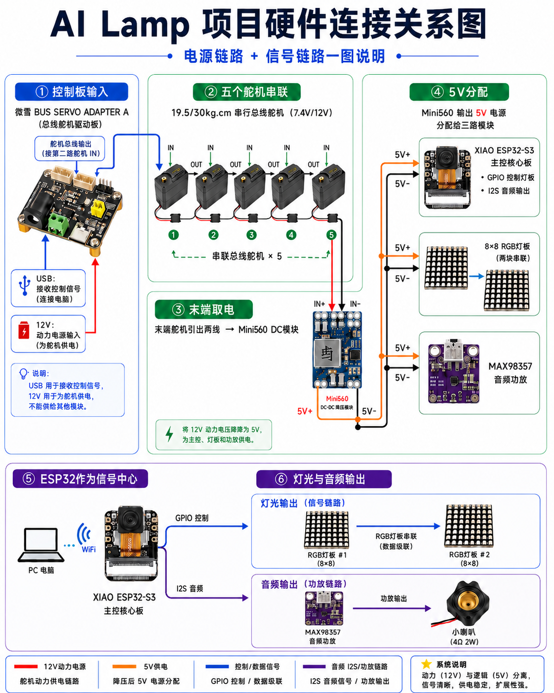
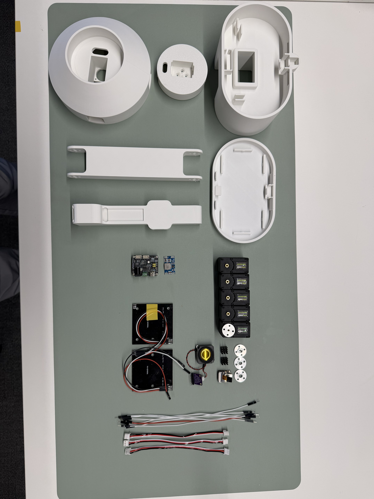

# Wiring Guide

This page is the public Markdown source for YareLampGo hardware wiring. It
replaces the uploaded spreadsheet version so wiring details are readable in
GitHub and easier to review in pull requests.

## Usage

按本表从上到下接线；任何模块换型号、换固件或换供电方案后，请同步更新此表。

## Wiring Table

| 模块/对象 | 端子/引脚 | 连接到 | 类型/电压 | 线材/接法 | 接线说明与验收要点 |
| --- | --- | --- | --- | --- | --- |
| 系统电源 | 12V DC圆口 适配器输出 | 总线舵机驱动板电源输入 | 主电源 | 按驱动板电源端子接入；先断电再接线 | 确认正负极和驱动板/舵机允许的输入电压后再上电；这是整机唯一主电源入口。 |
| 系统电源 | 总线舵机驱动板 GND | 5V 降压模块 Vin- / XIAO GND / LED V- / MAX98357 GND | 共地 | 所有低压模块必须共地 | 舵机电源、5V 降压输出、开发板、LED、功放需要共地，否则信号可能不稳定或完全不工作。 |
| 5V 降压模块 | Vin+ / Vin- | 从总线舵机供电链路取电 （从最后一个舵机取电） | 12V -> 5V 输入侧 | 红线接 Vin+、黑线接 Vin- | 取电位置是结构布线考虑，本质仍来自 12V 主电源；接入前确认正负。 |
| 5V 降压模块 | Vout+ / Vout- | 给 XIAO、WS2812 LED 灯板、MAX98357 功放供电 | 5V 输出侧 | 需要两根一分三杜邦线或等效分线端子 | 注意正负。 |
| XIAO 开发板 | 5V | 5V 降压模块 Vout+ | 5V 供电 | 红线 | 开发板由降压模块供电；如同时插 USB 调试，注意避免电源回灌风险。 |
| XIAO 开发板 | GND | 5V 降压模块 Vout- | 共地 | 黑线 | 所有外设信号线接入前先确认共地。 |
| MAX98357 功放 | VIN | 5V 降压模块 Vout+ | 5V 供电 | 红线 | 功放供电线尽量短，避免与舵机大电流线长距离并行。 |
| MAX98357 功放 | GND | 5V 降压模块 Vout- | 共地 | 黑线 | 与 XIAO 共地。 |
| MAX98357 功放 | LRC | XIAO D1 (GPIO2) | I2S LRCLK | 信号线 | 按现有程序/接线映射连接。 |
| MAX98357 功放 | BCLK | XIAO D0 (GPIO1) | I2S BCLK | 信号线 | 按现有程序/接线映射连接。 |
| MAX98357 功放 | DIN | XIAO D3 (GPIO4) | I2S DATA | 信号线 | 接到功放数据输入端。 |
| MAX98357 功放 | GAIN | 悬空 | 配置脚 | 不接 | 默认增益。 |
| MAX98357 功放 | SD | 悬空 | 使能/关断脚 | 不接 | 默认使能；若后续要静音控制，再单独分配 GPIO。 |
| 喇叭 | 端子 | MAX98357 喇叭输出端 | 音频输出 | 直接对插 | 当前喇叭线直接对插，不区分正反也能出声。 |
| WS2812 8x8 LED 灯板 | V+ / 5V | 5V 降压模块 Vout+ | 5V 供电 | 红线 | 确认实物是 8x8 / 64 颗 WS2812。 |
| WS2812 8x8 LED 灯板 | V- / GND | 5V 降压模块 Vout- | 共地 | 黑线 | LED 灯板必须与 XIAO 共地。 |
| WS2812 8x8 LED 灯板 | OUT | XIAO D2 (GPIO3) | NeoPixel 数据 | 信号线 | LED 阵列控制信号 |
| 总线舵机 | 5 个 ST3215 舵机 | 总线舵机驱动板，舵机之间依次串联 | TTL 总线 + 舵机电源 | 使用舵机专用三脚线束 | 线留余量，避免运动时拉扯。 |
| 总线舵机 | 末端取电位置 | 5V 降压模块 Vin | 从舵机供电链路分出 | 短线取电，固定防松 |  |
| 电脑上位机 | 无线连接 | XIAO / 台灯控制链路 | 无线 | 无需额外数据线 | 开发板通过无线与电脑上位机连接；USB 主要用于烧录、日志或调试。 |
| 布线固定 | 所有插头/杜邦线 | 对应模块端子 | 机械可靠性 | 扎带、胶点、热缩管或固定座 | 完成接线后轻拉每根线确认不松动；舵机附近的线束要避开转轴、齿轮和夹点。 |
