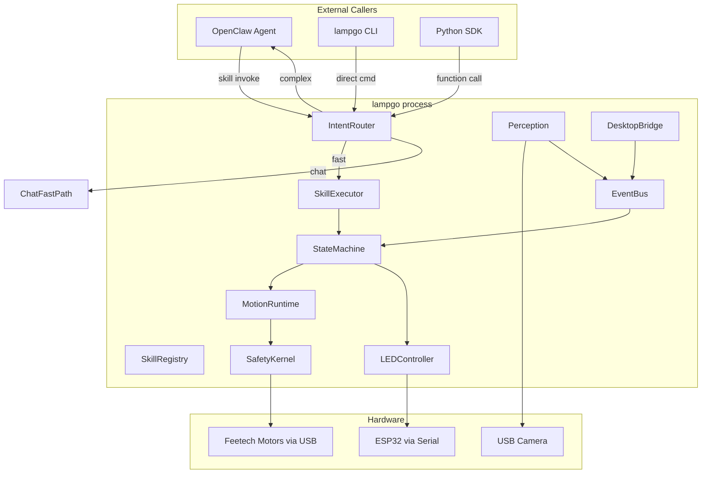
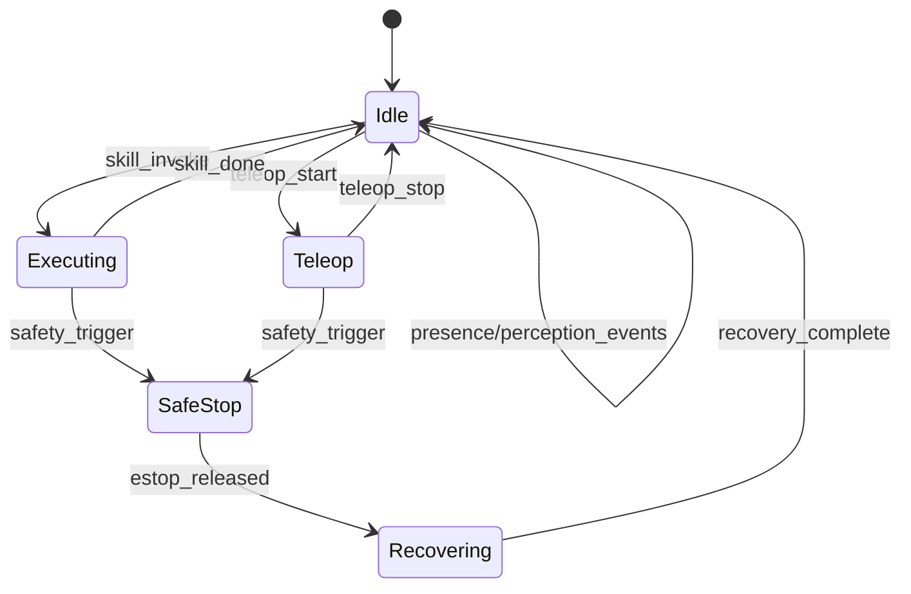

# lampgo - Desktop Embodied Intelligent Lamp Robot

## Background and Migration Strategy

**Current state**: Two legacy codebases that both need replacement:

- `gemini_robotics/` - Gemini Live demo with AnimationService, Pipecat pipeline, etc. Drop the server/bot stack entirely. Carry over: `lelamp_runtime/` HAL concepts, `recording/*.csv` assets, calibration data.
- `lelamp-skills/` - OpenClaw skill shell scripts + daemon. Drop entirely. Carry over: skill definitions (conceptually), daemon state machine ideas (rewritten).

**Target state**: Single Python monorepo at `/media/nins/28d9cecf-c6b8-4000-a2fe-7bfb8e61d220/ai/poc/arm/lampgo/` (与旧项目并列), Python 3.12, `uv` for package/environment management, clean layered architecture, asyncio event loop, in-process calls, lerobot dependency for bus/motor, OpenClaw adapter from day one.

**Toolchain**:

- Python >= 3.12
- `uv` for virtualenv creation, dependency resolution, lockfile (`uv.lock`), and script running
- `pyproject.toml` (PEP 621) as the single source of metadata and dependencies
- No `setup.py`, no `requirements.txt`, no `pip` — all dependency operations via `uv`

**What gets migrated (file level)**:

- `gemini_robotics/recording/*.csv` + `gemini_robotics/lelamp_runtime/lelamp/recordings/*.csv` -> `lampgo/assets/recordings/` (取并集，去重)
- `gemini_robotics/AL01*.json` calibration files -> `lampgo/assets/calibration/`
- Nothing from `lelamp-skills/` is copied directly; concepts are reimplemented cleanly

**What gets copied and adapted (code reuse)**:

- `gemini_robotics/lelamp_runtime/lelamp/follower/lelamp_follower.py` (~228 lines) -> 精简后约 150 行合入 `lampgo/core/hal.py`。保留: `FeetechMotorsBus` 连接/读写/校准逻辑。去掉: camera 混入、`max_relative_target` 安全裁剪(归 SafetyKernel)
- `gemini_robotics/lelamp_runtime/lelamp/follower/config_lelamp_follower.py` (~43 lines) -> 参考重写为 Pydantic 模型 `lampgo/core/config.py`
- `gemini_robotics/lelamp_runtime/lelamp/calibrate.py` (~104 lines) -> 适配为 `lampgo calibrate` CLI 子命令
- `gemini_robotics/lelamp_runtime/lelamp/setup_motors.py` (~18 lines) -> 合入 `lampgo/core/hal.py` 或独立 CLI 子命令
- `lelamp-skills/lelamp/scripts/lelamp_led.py` (~81 lines) -> 参考 ESP32 串口协议部分，融入 `lampgo/core/led.py`
- `gemini_robotics/lelamp_runtime/lelamp/leader/` (~189 lines) -> M3 Teleop 阶段再复制适配

**What gets dropped entirely (not reused)**:

- `gemini_robotics/server/*` (Pipecat, Daily, Gemini Live, AnimationController, tool handlers)
- `gemini_robotics/lelamp_runtime/main.py`, `smooth_animation.py` (LiveKit agent)
- `gemini_robotics/lelamp_runtime/lelamp/service/*` (motors_service, animation_service, base service thread model, rgb_service for RPi)
- `gemini_robotics/lelamp_runtime/lelamp/record.py`, `replay.py`, `list_recordings.py` (概念保留, 代码重写)
- `lelamp-skills/lelamp/scripts/lelamp_daemon.py` (顿挫问题的根源，从零重写)
- `lelamp-skills/lelamp/scripts/lelamp_ctl.py` (replaced by `lampgo cli`)
- All shell script skills (`*.sh`) — 编排概念变成 Python Skill 类
- All SKILL.md-driven control logic — OpenClaw adapter 自动生成能力描述
- `gemini_robotics/LeLamp/` (MuJoCo/URDF/simulation) — 保留在原位作为参考文档

**Code reuse summary**: 两个旧项目合计数千行代码，实际带走 ~400 行可复用代码 + ~30 个 CSV + ~3 个校准 JSON。这是一个 **新建项目**，不是重构。

**lerobot dependency strategy**: `lerobot` 作为 `lampgo` 的 pip 依赖（通过 `uv add`），使用其 `FeetechMotorsBus`、`Motor`、`MotorCalibration`、`MotorNormMode`。`LeLampFollower` 不是 lerobot 官方部分，其逻辑精简后合入 `lampgo/core/hal.py`，`lampgo` 不依赖旧仓库的任何 Python 包。

---

## Architecture




Key principles:

- **Single process, but control loop is isolated** - asyncio for orchestration, dedicated control thread for MotionRuntime tick (see "Control Loop Isolation" below)
- **Safety is a gate, not a suggestion** - all motor commands pass through SafetyKernel before reaching hardware
- **EventBus for decoupling** - perception/sensor events flow through a typed event bus, FSM subscribes
- **Skills are the only way to move** - no raw `set_joints` exposed to callers; skills wrap all motion

---

## Control Loop Isolation

MotionRuntime's control tick must be protected from asyncio task scheduling jitter. Design:

```
Main Thread (asyncio event loop)
  - CLI / OpenClaw requests
  - Skill orchestration
  - Perception callbacks
  - LED commands
  - EventBus dispatch

Control Thread (dedicated, real-time-ish)
  - Strict tick at configured rate (default 50Hz / 20ms)
  - Reads current joint state from HAL
  - Computes next interpolation frame
  - Passes frame through SafetyKernel
  - Writes to HAL
  - Never blocked by asyncio tasks
```

Communication between threads:

```python
# asyncio side sends targets via thread-safe queue
class MotionRuntime:
    _target_queue: queue.Queue[MotionTarget]   # asyncio -> control thread
    _status: MotionStatus                       # control thread -> asyncio (atomic read)
    _control_thread: threading.Thread

    def update_target(self, target: MotionTarget) -> None:
        self._target_queue.put_nowait(target)   # non-blocking

    def _control_loop(self) -> None:
        while self._running:
            t0 = time.monotonic()
            # drain latest target from queue (only use newest)
            while not self._target_queue.empty():
                self._current_target = self._target_queue.get_nowait()
            # compute next frame, validate, write
            frame = self._interpolate(self._current_target, dt)
            frame = self._safety.validate_frame(self._state, frame, dt)
            self._hal.write_positions(frame)
            # strict tick budget
            elapsed = time.monotonic() - t0
            remaining = self._tick_interval - elapsed
            if remaining > 0:
                time.sleep(remaining)
```

Rules:

- Control thread never does IO besides serial bus write
- Control thread never awaits asyncio coroutines
- If target queue is empty, control thread holds last target (no drift)
- If tick budget exceeded, log warning but never skip safety validation
- asyncio side reads status via atomic property, never blocks control thread

---

## Monorepo Structure

```
lampgo/
  pyproject.toml              # PEP 621, Python >=3.12, extras: [perception], [bridge], [dev]
  uv.lock                     # uv lockfile, committed to repo
  .python-version             # 3.12
  README.md
  lampgo/
    __init__.py               # version, top-level convenience imports
    core/
      __init__.py
      types.py                # JointState, Pose, MotionTarget, etc. (dataclasses)
      config.py               # DeviceConfig, MotionConfig, SafetyConfig (Pydantic)
      hal.py                  # HardwareAbstraction: wraps lerobot FeetechMotorsBus
      safety.py               # SafetyKernel: joint limits, velocity, acceleration, estop
      motion.py               # MotionRuntime: trapezoidal interpolation, trajectory tracking
      led.py                  # LEDController: ESP32 serial protocol
      events.py               # EventBus: typed publish/subscribe
    skills/
      __init__.py
      base.py                 # Skill base class, SkillResult, SkillContext
      registry.py             # SkillRegistry: register, lookup, list capabilities
      executor.py             # SkillExecutor: run with cancel/timeout/rollback
      fsm.py                  # StateMachine: Idle/Executing/Teleop/SafeStop/etc.
      builtin/
        __init__.py
        motion_skills.py      # move_to, nod, look_at, idle_sway, return_safe
        playback_skills.py    # play_recording (CSV-based action playback)
        expression_skills.py  # LED patterns + motion combos
        reactive_skills.py    # face_follow, presence_react
      recorder.py             # TeachRecorder: record user manipulation as CSV
    perception/
      __init__.py
      presence.py             # Lightweight person detection (OpenCV)
      audio.py                # VAD / wake word (optional)
      router.py               # IntentRouter: rule -> classifier -> LLM fallback
    bridge/
      __init__.py
      openclaw.py             # OpenClaw adapter: expose skills as OpenClaw capabilities
      desktop.py              # DesktopBridge: keyboard/mouse/app launch via pyautogui
    server.py                 # Main entry: creates all components, runs asyncio loop
    cli.py                    # CLI: lampgo run / lampgo move / lampgo play / lampgo record
  assets/
    recordings/               # Migrated CSV action files
    calibration/              # Migrated calibration JSON
  tests/
    conftest.py               # Shared fixtures (mock HAL, mock bus)
    test_safety.py
    test_motion.py
    test_skills.py
    test_fsm.py
  docs/
    architecture.md           # This plan, maintained as living doc
  examples/
    basic_motion.py           # "5 lines to make it nod"
    custom_skill.py           # How to write a skill
    openclaw_integration.py   # How OpenClaw calls lampgo
```

---

## Core Module Details

### `core/types.py` - Foundation Types

```python
@dataclass(frozen=True)
class JointState:
    positions: dict[str, float]   # joint_name -> value
    timestamp: float

@dataclass
class MotionTarget:
    joints: dict[str, float]      # target positions (partial OK)
    max_velocity: float | None     # deg/s per joint, None = use config default
    max_acceleration: float | None

@dataclass
class MotionStatus:
    target: MotionTarget | None
    progress: float               # 0.0 ~ 1.0
    is_done: bool
```

### `core/hal.py` - Hardware Abstraction

Wraps lerobot's FeetechMotorsBus. The key difference from current code: HAL only does read/write, no interpolation, no state machine logic.

```python
class HardwareAbstraction:
    def __init__(self, config: DeviceConfig): ...
    async def connect(self) -> None: ...
    async def disconnect(self) -> None: ...
    def read_positions(self) -> JointState: ...
    def write_positions(self, positions: dict[str, float]) -> None: ...
    def read_health(self) -> DeviceHealth: ...
```

Reuses lerobot's `FeetechMotorsBus`, `Motor`, `MotorCalibration`, `MotorNormMode` directly.

### `core/safety.py` - Safety Kernel

**This is the single gate between motion commands and hardware.**

```python
class SafetyKernel:
    # --- Frame-level validation (called every control tick) ---
    def validate_target(self, current: JointState, target: MotionTarget) -> MotionTarget | SafetyRejection: ...
    def validate_frame(self, current: JointState, next_frame: dict[str, float], dt: float) -> dict[str, float]: ...

    # --- Emergency stop (persistent state, explicit reset required) ---
    def estop(self, reason: str) -> None: ...
    def reset_estop(self) -> None: ...
    def is_estopped(self) -> bool: ...
    @property
    def last_estop_reason(self) -> str | None: ...

    # --- Connection health ---
    def report_bus_health(self, connected: bool) -> None: ...
    def check_heartbeat(self) -> None: ...  # called by control loop; triggers estop if stale
```

**M1 safety scope** (what gets implemented in Weeks 2-3):

- Joint position limits (per-joint min/max)
- Per-joint max velocity and max acceleration clamping
- Persistent estop state (only `reset_estop()` can clear it)
- Serial bus disconnect detection -> auto estop
- All rejections logged with reason (structured logging)

**Deferred to M2+**:

- Heartbeat timeout watchdog (control loop monitors command freshness)
- Power-on default posture and torque-on/off strategy
- CSV playback frame-level boundary violation policy (truncate vs abort)
- Desktop bridge reverse estop trigger

### `core/motion.py` - Motion Runtime (THE critical fix)

This replaces the broken linear interpolation in current `lelamp_daemon.py`. The core change:

**Current (broken)**: `interp = cur + (tgt - cur) * progress` with `progress` reset every call.

**New**: Trapezoidal velocity profile with fixed start/end points, proper acceleration/deceleration phases.

```python
class MotionRuntime:
    async def move_to(self, target: MotionTarget) -> None: ...
    async def stream_frames(self, frames: list[dict[str, float]], fps: int) -> None: ...
    def update_target(self, target: MotionTarget) -> None:  # smooth re-targeting without reset
    def stop_smooth(self) -> None: ...
    def stop_immediate(self) -> None: ...
    @property
    def status(self) -> MotionStatus: ...
```

Key design:

- `move_to()`: single target, trapezoidal velocity profile, awaitable
- `stream_frames()`: CSV playback, one frame per tick at given fps
- `update_target()`: change target mid-motion WITHOUT resetting velocity (solves the jitter!)
- Internal tick loop runs at configurable rate (default 50Hz), passes every frame through SafetyKernel

### `core/events.py` - Event Bus

Simple typed pub/sub, no external dependency:

```python
class EventBus:
    def subscribe(self, event_type: type[T], handler: Callable[[T], Awaitable[None]]) -> None: ...
    async def publish(self, event: Event) -> None: ...
```

Event types: `PresenceDetected`, `WakeWordTriggered`, `SkillStarted`, `SkillFinished`, `SafetyTriggered`, `EStopActivated`, etc.

---

## Skill System

### Skill Base Class

```python
class Skill(ABC):
    skill_id: str
    description: str
    parameters: dict[str, ParameterSpec]  # for OpenClaw schema exposure

    @abstractmethod
    async def execute(self, ctx: SkillContext, **params) -> SkillResult: ...

    async def cancel(self) -> None: ...  # optional override
    async def rollback(self) -> None: ... # optional override
```

### SkillContext provides safe access

```python
class SkillContext:
    motion: MotionRuntime    # move_to, stream_frames
    led: LEDController
    events: EventBus
    state: JointState        # current state snapshot
```

Skills never access HAL directly. They go through MotionRuntime (which goes through SafetyKernel).

### Built-in Skills (M1)

- `move_to` - Move to joint target (replaces raw set_joints)
- `play_recording` - Play CSV action file (replaces play command)
- `nod`, `dance`, `wave`, `idle_sway` - Parametric motion primitives
- `set_expression` - LED pattern + optional motion combo
- `return_safe` - Return to safe position (smooth)
- `estop` - Emergency stop

### Skill Scheduling Rules (M1)

M1 uses a simple, hard-coded priority scheme instead of a configurable matrix:

```
Priority (highest first):
  1. estop            - always wins, immediately stops motion
  2. return_safe      - cannot be preempted by normal skills
  3. any new skill    - cancels currently executing skill (last-writer-wins)
```

Concrete rules:

- Only one skill executes at a time (no parallel skill execution in M1)
- New `invoke()` call cancels the current skill, waits for its `cancel()`, then starts the new one
- `return_safe` and `estop` are exceptions: they preempt without waiting
- `play_recording` and `move_to` have equal priority; latest call wins
- Reactive skills (M2) will add a "background vs foreground" distinction later

This is intentionally simple. A priority matrix will be introduced only when real skill conflicts emerge (expected around M2/M3 when reactive skills coexist with user-invoked skills).

---

## OpenClaw Integration (M1)

The adapter exposes lampgo skills as OpenClaw-callable tools:

```python
class OpenClawAdapter:
    def __init__(self, registry: SkillRegistry, executor: SkillExecutor): ...

    def get_capabilities(self) -> list[CapabilitySpec]: ...
    async def invoke(self, skill_id: str, params: dict) -> InvokeResult: ...
    async def cancel(self, invocation_id: str) -> None: ...
    def subscribe_events(self, callback: Callable) -> None: ...
```

Each registered Skill automatically becomes an OpenClaw capability with typed parameters derived from the skill's `parameters` spec.

### OpenClaw Invocation Semantics (M1 scope)

**M1 provides minimal but correct semantics:**

```python
@dataclass
class InvokeResult:
    invocation_id: str          # unique per call
    status: Literal["ok", "rejected", "cancelled", "error"]
    error_code: str | None      # "unknown_skill", "invalid_params", "safety_rejected", "timeout"
    error_detail: str | None
    result: dict | None         # skill-specific return data
```

- `invoke()` is synchronous from the caller's perspective: it awaits skill completion or cancellation
- `cancel()` is soft cancel: sends cancellation request to the running skill, skill decides how to clean up
- Duplicate `invoke()` with same skill while previous is running: previous gets cancelled first
- Parameter validation happens before execution starts; rejects return immediately with error code

**Deferred to M3+:**

- Invocation status streaming (progress updates for long skills)
- Long-task async callback model
- High-risk action confirmation flow (for desktop bridge)
- Idempotency keys
- Full audit logging (M1 uses structured logs only)

---

## State Machine (Simple FSM, not BT)




M1 only needs: Idle, Executing, SafeStop, Recovering. Teleop added in M3.

---

## CLI Design

All commands run via `uv run lampgo <subcommand>` or after `uv sync` as `lampgo <subcommand>`:

```bash
lampgo run                              # Start main server
lampgo run --no-perception              # Skip camera/audio
lampgo move base_yaw=30 base_pitch=-20  # Direct move (wraps move_to skill)
lampgo play nod                         # Play recording
lampgo record my_action                 # Enter teach mode, record to CSV
lampgo skills                           # List available skills
lampgo status                           # Current state, joints, mode
lampgo monitor                          # Real-time joint state, tick rate, safety
lampgo calibrate                        # Interactive motor calibration
lampgo estop                            # Emergency stop
```

CLI entry point registered in `pyproject.toml`:

```toml
[project.scripts]
lampgo = "lampgo.cli:main"
```

---

## Milestones

### M1: Device Controllable Baseline + OpenClaw Skeleton (Weeks 1-6)

**Week 1: Scaffold**

- `uv init lampgo && cd lampgo` 初始化项目
- `pyproject.toml`: Python >=3.12, PEP 621, dependency groups `[perception]`, `[bridge]`, `[dev]`
- `.python-version`: 3.12
- `uv add lerobot structlog pydantic` (core deps)
- `uv add --group dev pytest pytest-asyncio`
- Git init, `.gitignore`, basic CI (GitHub Actions: `uv sync && uv run pytest`)
- `core/types.py`, `core/config.py` (Pydantic models)
- Migrate recording CSV assets (取两个旧目录并集) and calibration JSON files
- Copy + refactor `lelamp_follower.py` -> `core/hal.py` (去掉 camera, 去掉内置 safety clipping)
- Basic test infrastructure with mock HAL

**Week 2-3: Core runtime**

- `core/hal.py` wrapping lerobot bus
- `core/safety.py` with joint limits + velocity limits + persistent estop + bus disconnect detection
- `core/motion.py` with trapezoidal velocity interpolation + dedicated control thread (see "Control Loop Isolation")
- `core/led.py` for ESP32 serial
- `core/events.py` event bus
- Structured logging throughout core (Python logging + structlog)
- `lampgo monitor` CLI command: real-time joint target vs actual + tick rate display (the single most important debug tool)
- **Acceptance**: single `move_to` command executes smoothly, no jitter; control loop holds stable 50Hz under load; serial disconnect triggers auto-estop

**Week 4: Skill system**

- `skills/base.py`, `skills/registry.py`, `skills/executor.py`
- `skills/fsm.py` (Idle, Executing, SafeStop)
- `skills/builtin/motion_skills.py` (move_to, return_safe)
- `skills/builtin/playback_skills.py` (play_recording - CSV playback)
- **Acceptance**: can play all migrated CSV recordings smoothly

**Week 5: CLI + OpenClaw adapter**

- `cli.py` with run/move/play/status/estop
- `bridge/openclaw.py` adapter skeleton
- **Acceptance**: `lampgo run` starts, `lampgo play nod` works, OpenClaw can list capabilities

**Week 6: Polish + expression skills**

- `skills/builtin/expression_skills.py` (LED + motion combos)
- Parametric skills: nod(amplitude, speed), look_at(yaw, pitch)
- Documentation: README, architecture.md, basic examples
- **Acceptance**: OpenClaw agent can invoke 10+ skills

### M2: Perception + Intent Router + Safety Hardening (Weeks 7-10)

- `perception/presence.py` - OpenCV person detection
- `perception/audio.py` - VAD
- `perception/router.py` - Rule-based intent classification
- Chat fast path (simple intent -> direct response, no task dispatch)
- Reactive skills (face_follow, presence_react)
- Skill priority: add background/foreground distinction for reactive vs user-invoked
- Safety hardening: heartbeat watchdog, power-on posture strategy, CSV boundary policy
- Observability: event timeline, skill execution history, fault code registry
- **Acceptance**: "ni hao" gets sub-1s response; presence detection triggers greeting; reactive skills coexist with manual invocations without conflict

### M3: PC Bridge + Teleop (Weeks 11-14)

- `bridge/desktop.py` - abstract `InputBackend` interface, pyautogui as default backend (swappable for HID/platform-specific later)
- Teleop mode in FSM (user manipulates arm, maps to input)
- Gamepad mode mapping
- Permission system for desktop actions
- OpenClaw adapter: invocation status streaming, high-risk action confirmation, audit log
- Safety: desktop bridge estop integration (misoperation triggers disable)
- **Acceptance**: arm-as-gamepad demo works, app launch via skill works, desktop actions require permission grant

### M4: User Creation + Modularity (Weeks 15-18)

- `skills/recorder.py` - teach mode recording
- Trajectory smoothing and compression
- User-recorded actions auto-register as skills
- Magnetic module discovery and integration protocol
- **Acceptance**: user records custom action, names it, OpenClaw can call it

---

## Team Assignment Suggestion

- **You (software + architecture)**: core/*, skills/*, bridge/openclaw.py, cli.py, CI, code review
- **T (algorithm)**: perception/*, router, optional ML enhancements
- **Incoming full-time embodied algorithm**: skills/builtin/reactive_skills, motion primitives (look_at, face_follow, idle_sway), IK if needed later
- **Control algorithm intern**: core/motion.py (trapezoidal profile, S-curve later), core/safety.py, tuning and testing with real hardware

---

## Observability (Minimum Viable, M1-M2)

**M1 (embedded in core from day one):**

- Python `structlog` for structured JSON logging throughout all modules
- `lampgo monitor` CLI: real-time display of joint state, target, tick rate, safety status
- All SafetyKernel rejections logged with reason and context
- estop history (last reason + timestamp)

**M2 additions:**

- Event timeline: ordered log of SkillStarted/Finished/Cancelled/SafetyTriggered events
- Skill execution history: last N invocations with duration, result, and caller
- Fault code registry: motor health snapshot, bus errors, tick overruns
- OpenClaw invocation audit: who called what, when, result

This is intentionally kept lightweight. No metrics server, no dashboard, no tracing framework. Just structured logs + CLI inspection.

---

## Key Differences from GPT Spec

- **4 packages instead of 10** - right-sized for team
- **No BT in M1-M3** - FSM is sufficient, BT added only if needed
- **No IK in M1** - joint-space control first, IK only when look_at needs it
- **No DSL in M1-M3** - YAML DSL deferred until 20+ real skills exist
- **No separate safety-kernel repo** - safety is a module in core, not a service
- **OpenClaw in M1** - adapter skeleton from day one per your requirement
- **Trapezoidal velocity as THE M1 priority** - directly fixes the jitter problem
- **Control loop isolated in dedicated thread** - protects motor tick from asyncio jitter (ChatGPT Gap #1)
- **SafetyKernel expanded to cover fault model** - not just pre-flight check, includes disconnect/heartbeat/persistent estop (ChatGPT Gap #2)
- **Skill scheduling rules explicit** - simple last-writer-wins + estop/return_safe priority, matrix deferred to M2 (ChatGPT Gap #3)
- **OpenClaw invocation semantics defined** - error codes, cancel, validation; streaming/audit deferred to M3 (ChatGPT Gap #4)
- **Observability minimum set defined** - structlog + CLI monitor in M1, event history in M2 (ChatGPT Gap #5)
- **Desktop bridge abstracted behind InputBackend** - not hardwired to pyautogui (ChatGPT Gap #6)