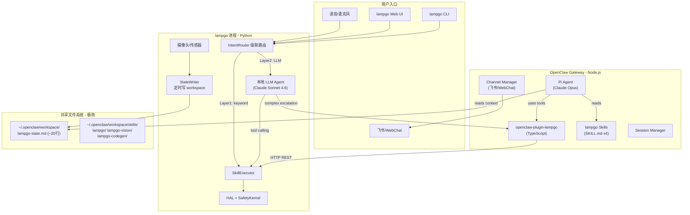
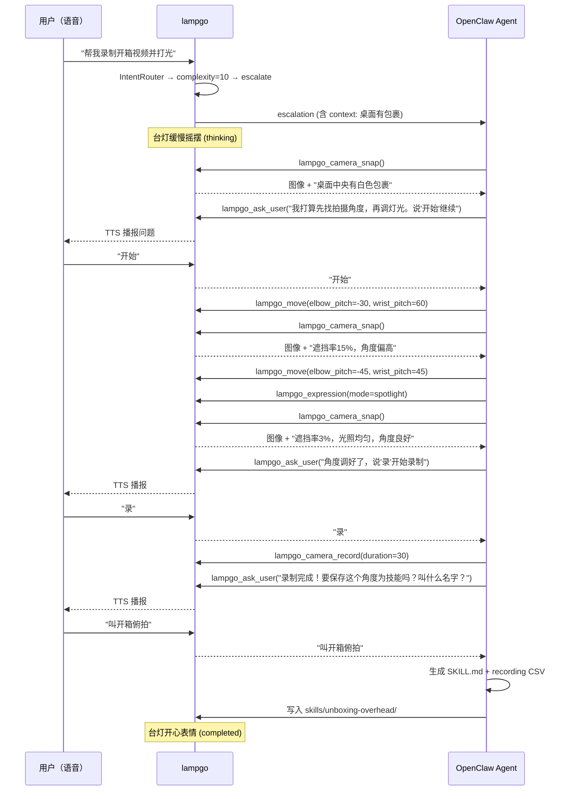

# lampgo 接入 OpenClaw 生态方案

## 一、总体架构：三层集成模型

lampgo 与 OpenClaw 的集成采用 **"Plugin Bridge + Skills Knowledge + Shared Workspace"** 三层模型，兼顾开源优雅性和 demo 级别的实用性。




### 核心设计原则

- **lampgo 是硬件主权方**：所有物理动作最终都经过 lampgo 的 SafetyKernel，OpenClaw 无法绕过
- **OpenClaw 是智力放大器**：仅在本地 LLM 无法处理时升级，借用其长链路推理和社区生态
- **Plugin 是唯一桥接点**：避免 lampgo 直接实现 OpenClaw WS 协议（脆弱且耦合重），用 TypeScript Plugin 做适配层
- **文件系统极简**：workspace 只放极简状态标记（<20 行），详细信息通过 Plugin tool 按需拉取，避免污染 OpenClaw 的上下文窗口

---

## 二、问题 1：Chat/Memory 互通设计

### 方案：双层记忆架构

**短期记忆（会话级）**：通过 Plugin 的 tool execution context 传递

```
lampgo 本地 LLM 会话 ──escalation──> OpenClaw Plugin
                                        │
                                        ├─ 携带: recent_messages (最近 5 轮对话摘要)
                                        ├─ 携带: recent_tool_calls (最近执行的技能)
                                        ├─ 携带: device_state (关节状态/LED/传感器)
                                        └─ 注入到 OpenClaw session 的 system prompt
```

**长期记忆（持久化）**：通过共享 workspace 文件，**严格控制体积**

设计原则：workspace 文件不能膨胀 OpenClaw 的 system prompt。lampgo 只写一个极简状态文件，OpenClaw agent 需要详细信息时主动调 tool 拉取。

- lampgo daemon 仅在状态变化时写入 `~/.openclaw/workspace/lampgo-state.md`（纯文本，<20 行）：

```markdown
# lampgo device (updated: 2026-03-31T14:30:00)
- status: idle
- led: happy
- camera: connected
- mic: active
- user_presence: true
- last_action: look_at (2min ago)
```

- 只写**设备连接状态**（camera: connected, mic: active），不写感知内容（"桌上有包裹"）
- 感知内容是瞬时数据，通过 Plugin tool 按需获取：`lampgo_camera_snap` 拿实时画面，`lampgo_status` 拿完整设备状态
- SKILL.md 中明确说明这一区分

### 具体实现路径

1. 在 `lampgo/bridge/state_writer.py` 新增 `StateWriter` 类，**仅在状态变化时**写极简 markdown 到 workspace（避免定时轮询写入垃圾）
2. Plugin 注册 `lampgo_status` tool 供 agent **按需**拉取完整状态（关节角度、传感器数据等），不预注入 system prompt
3. escalation 时，`_handoff_to_openclaw()` 将本地 LLM 的对话摘要（<500 token）作为 tool 参数传入，而非写文件

---

## 三、问题 2：复杂任务定义（何时走 OpenClaw）

### 方案：结构化 complexity 评分

替换现有 `_looks_composite()` 的简单启发式，改为 **multi-signal scoring**：

```python
# lampgo/perception/router.py 中的升级逻辑
COMPLEXITY_SIGNALS = {
    "no_skill_match": 3,          # 没有任何 skill 匹配
    "multi_step_markers": 2,      # "然后/再/并且/接着" 等连接词
    "creative_synthesis": 3,      # "创作/设计/编排/自定义" 等创造性词汇
    "cross_domain": 4,            # 同时涉及物理动作和屏幕操作
    "external_knowledge": 3,      # 需要搜索/代码生成/文件操作
    "llm_explicit_complex": 5,    # 本地 LLM 明确返回 "complex"
    "long_input": 1,              # 用户输入超过 50 字
}
ESCALATION_THRESHOLD = 5
```

### 典型场景分类


| 场景                | 得分       | 走向                                       |
| ----------------- | -------- | ---------------------------------------- |
| "点头"              | 0        | Layer 1 关键词                              |
| "看看桌上有什么"         | 0        | Layer 2 本地 LLM (capture_image + analyze) |
| "站起来扭一下"          | 2        | Layer 2 本地 LLM (move_to sequence)        |
| "帮我录制开箱视频并打光"     | 3+3+4=10 | Layer 3 OpenClaw                         |
| "每天早上 8 点跳个舞叫我起床" | 3+3=6    | Layer 3 OpenClaw (需 cron + 编排)           |
| "帮我写一个新的摇摆动作"     | 3+3=6    | Layer 3 OpenClaw (需 codegen)             |


### 本地 LLM 的 "认输" 机制

在 `LLMClient.run_agent_loop()` 的 tool 列表中增加一个 `escalate_to_openclaw` tool：

```python
{
    "name": "escalate_to_openclaw",
    "description": "当前任务超出本地能力，需要更强的推理/代码生成/外部工具。调用此工具将任务升级到 OpenClaw 长链路。",
    "parameters": {
        "reason": "string: 为什么需要升级",
        "context_summary": "string: 当前已知的上下文摘要"
    }
}
```

这让本地 LLM 可以**主动认输**，而不只是被动触发 `max_agent_turns` 用尽。

---

## 四、问题 3：OpenClaw 链路中的用户通信

### 核心原则：lampgo 始终做"脸"，OpenClaw 始终在幕后

用户从哪个入口进来，反馈就从哪个入口回去。用户对着台灯说话时，不应被要求切到飞书去确认操作。

```mermaid
flowchart TB
    subgraph SyncPath [同步交互：用户从 lampgo 入口进入]
        UserVoice["用户语音/CLI/Web UI"] --> LG_Route[lampgo IntentRouter]
        LG_Route -->|escalate| OC_Agent[OpenClaw Agent]
        OC_Agent -->|"需要确认/反馈"| Plugin_CB["Plugin → HTTP callback"]
        Plugin_CB --> LG_Relay["lampgo 中继层"]
        LG_Relay -->|TTS| UserVoice
        LG_Relay -->|WebSocket| LG_WebUI["lampgo Web UI"]
        LG_Relay -->|"LED/动作"| LG_Physical[台灯物理反馈]
    end

    subgraph RemotePath [远程入口：用户从飞书/WebChat 进入]
        UserFeishu[飞书/WebChat] --> OC_Direct[OpenClaw Agent]
        OC_Direct -->|回复| UserFeishu
        OC_Direct -->|"lampgo_* tools"| LG_Exec[lampgo 执行]
    end

    subgraph AsyncNotify [异步通知：后台长任务完成]
        OC_BG[OpenClaw 后台任务] -->|完成| Feishu_Notify["飞书推送（可选）"]
        OC_BG -->|callback| LG_Notify["台灯物理提示\n(开心表情)"]
    end
```




### 三种场景的通道路由

**场景 A — 用户通过 lampgo 本地交互发起（同步）**

OpenClaw 的所有问询/确认通过 Plugin callback 回到 lampgo，lampgo 用 TTS + Web UI + 物理动作呈现。用户感知不到 OpenClaw 的存在。

```
用户 → lampgo 语音："帮我录开箱视频"
  → escalate to OpenClaw
  → OpenClaw 需要确认 → Plugin callback → lampgo
  → lampgo TTS："我打算先找拍摄角度，再调灯光。说'开始'继续"
  → 用户说："开始" → lampgo 转发 → OpenClaw 继续执行
```

**场景 B — 用户通过飞书/WebChat 远程发起**

反馈自然留在飞书/WebChat 内，lampgo 只做物理执行。

**场景 C — 后台长任务完成（异步）**

台灯做"开心"表情物理提示，飞书推送可选的完成通知。

### 实现要点：Plugin 双向回调

Plugin 注册一个 `lampgo_ask_user` tool，供 OpenClaw agent 在需要用户确认时调用：

```typescript
api.registerTool({
  name: "lampgo_ask_user",
  description: "通过台灯向用户提问并等待回复（语音 TTS + Web UI 同时呈现）",
  parameters: Type.Object({
    question: Type.String({ description: "要问用户的问题" }),
    options: Type.Optional(Type.Array(Type.String(), { description: "可选的选项列表" }))
  }),
  async execute(_id, params) {
    const res = await fetch(`${LAMPGO_API}/api/openclaw/ask`, {
      method: "POST",
      body: JSON.stringify(params)
    });
    // lampgo 通过 TTS 播报问题，等待用户语音/Web UI 回复
    // 阻塞直到用户回复或超时
    return { content: [{ type: "text", text: userReply }] };
  }
});
```

lampgo 侧对应新增：

- `POST /api/openclaw/ask` → TTS 播报问题 + Web UI 显示 + 等待用户回复
- `POST /api/openclaw/callback` → 接收 OpenClaw 任务状态变更 → 触发物理反馈动画

### 物理反馈映射

```python
OPENCLAW_STATUS_ANIMATIONS = {
    "planning": "idle_sway",           # 思考中 → 缓慢摇摆
    "executing": "set_expression:working",  # 执行中 → 工作表情
    "awaiting_user": "nod",            # 等用户回复 → 缓慢点头
    "completed": "set_expression:happy", # 完成 → 开心
    "failed": "set_expression:sad",      # 失败 → 难过
}
```

### 通道角色定位

- **lampgo（TTS / Web UI / 物理动作）**：同步交互的主通道，用户从 lampgo 进来就在 lampgo 完成
- **飞书**：远程入口 + 异步通知，不参与本地同步交互
- **WebChat**：OpenClaw 内置兜底

---

## 五、问题 4：传感器上下文注入 + 屏幕任务委托

### 传感器 → OpenClaw 上下文增强

Plugin 注册的 tools 中包含传感器访问能力：

```typescript
// openclaw-plugin-lampgo/index.ts 中的工具注册

api.registerTool({
  name: "lampgo_camera_snap",
  description: "拍摄当前摄像头画面，返回 base64 图像 + 场景描述",
  parameters: Type.Object({}),
  async execute() {
    const res = await fetch(`${LAMPGO_API}/api/camera/snap`);
    return { content: [{ type: "image", ... }, { type: "text", text: description }] };
  }
});

api.registerTool({
  name: "lampgo_sensor_context",
  description: "获取台灯传感器综合上下文：环境光照、人体存在、噪音等级、设备姿态",
  parameters: Type.Object({}),
  async execute() {
    const state = await fetch(`${LAMPGO_API}/api/status`);
    // 结构化返回给 agent
  }
});
```

### 感知职责分工

屏幕内和屏幕外的感知严格分离，各用最适合的手段：

- **屏幕内感知**：OpenClaw 自有能力（`browser` tool 截图、`exec` 截屏、`canvas` 等），清晰度高、零额外成本
- **屏幕外 / 物理世界感知**：lampgo 摄像头（桌面物品、人脸、光照环境、机械臂自身姿态等）

```
用户："帮我在浏览器打开某个网站，然后截图发给我"
  │
  ├─ 屏幕内：OpenClaw browser tool 打开网页 + 自带截图
  └─ 物理世界（如需）：lampgo_camera_snap 拍桌面确认周围环境
```

### lampgo Web Gateway 需新增的 API

在 [lampgo/web/gateway.py](lampgo/web/gateway.py) 中新增：

- `GET /api/camera/snap` → 调用 CameraCapture，返回 base64 JPEG + metadata
- `GET /api/sensor/context` → 聚合传感器数据（presence, ambient, device state）
- `POST /api/openclaw/ask` → 接收 OpenClaw 的用户问询，TTS 播报 + Web UI 显示，阻塞等待用户回复
- `POST /api/openclaw/callback` → 接收 OpenClaw Plugin 的任务状态变更 → 触发物理反馈动画
- `WS` 增加 `openclaw_status` / `openclaw_ask` 事件类型 → 推送到 Web UI

---

## 六、问题 5：动态技能创建（"录制开箱视频"场景）

### 方案：OpenClaw Agent Loop + lampgo 传感器反馈 = 即时技能编排




### 技能沉淀路径

OpenClaw 完成任务后，通过 `exec` tool 或 Plugin 的 file write 能力：

1. 将最终的关节轨迹保存为 `assets/recordings/unboxing_overhead.csv`
2. 生成对应的 OpenClaw SKILL.md 到 workspace skills 目录
3. 下次用户说"开箱俯拍"时，lampgo 的关键词表已更新，直接走 Layer 1

---

## 七、实现模块清单

### 新增文件


| 文件                                            | 语言     | 职责                                           |
| --------------------------------------------- | ------ | -------------------------------------------- |
| `openclaw-plugin-lampgo/package.json`         | JSON   | Plugin 包配置 + openclaw metadata               |
| `openclaw-plugin-lampgo/openclaw.plugin.json` | JSON   | Plugin manifest                              |
| `openclaw-plugin-lampgo/index.ts`             | TS     | Plugin 入口：注册 8 个 tools + hooks               |
| `lampgo/bridge/state_writer.py`               | Python | 定时写 workspace state JSON                     |
| `lampgo/bridge/openclaw_client.py`            | Python | HTTP client 向 OpenClaw Gateway 发送 escalation |


### 修改文件


| 文件                                                                 | 改动                                                                                          |
| ------------------------------------------------------------------ | ------------------------------------------------------------------------------------------- |
| [lampgo/perception/router.py](lampgo/perception/router.py)         | 替换 `_looks_composite()` 为 complexity scoring                                                |
| [lampgo/bridge/openclaw.py](lampgo/bridge/openclaw.py)             | `submit_complex_task` 改为真实 HTTP escalation                                                  |
| [lampgo/web/gateway.py](lampgo/web/gateway.py)                     | 新增 `/api/camera/snap`, `/api/sensor/context`, `/api/openclaw/ask`, `/api/openclaw/callback` |
| [lampgo/server.py](lampgo/server.py)                               | 集成 StateWriter，启动时尝试连接 OpenClaw                                                             |
| [openclaw-skills/lampgo/SKILL.md](openclaw-skills/lampgo/SKILL.md) | 更新为 Plugin tool 导向（不再是 CLI 导向）                                                              |


### Plugin 注册的 8 个 Tools


| Tool 名                     | 描述             | 映射到 lampgo API                               |
| -------------------------- | -------------- | -------------------------------------------- |
| `lampgo_move`              | 移动关节到目标位置      | `POST /api/invoke {skill: "move_to"}`        |
| `lampgo_expression`        | 设置 LED 表情      | `POST /api/invoke {skill: "set_expression"}` |
| `lampgo_play`              | 播放预录动作         | `POST /api/invoke {skill: "play_recording"}` |
| `lampgo_camera_snap`       | 拍摄当前画面         | `GET /api/camera/snap`                       |
| `lampgo_status`            | 获取设备状态         | `GET /api/status`                            |
| `lampgo_sensor_context`    | 获取传感器综合上下文     | `GET /api/sensor/context`                    |
| `lampgo_record_trajectory` | 录制当前轨迹为 CSV    | `POST /api/invoke {skill: "record"}`         |
| `lampgo_ask_user`          | 通过台灯向用户提问并等待回复 | `POST /api/openclaw/ask`                     |


### Plugin 注册的 Hooks


| Hook                             | 用途                                       |
| -------------------------------- | ---------------------------------------- |
| `before_tool_call` (lampgo_move) | 高风险动作（大角度移动）→ `requireApproval: true`    |
| Event listener                   | 监听 OpenClaw task 状态 → 回调 lampgo 触发物理反馈动画 |


---

## 八、部署拓扑（100 KOL 场景）

```
单台 PC / Mac（KOL 桌面）
  ├── lampgo daemon (Python, 控制硬件)
  │     ├── USB → Feetech Motors
  │     ├── USB → ESP32 LED
  │     ├── USB → Camera
  │     └── HTTP :18790 (Web Gateway)
  │
  ├── OpenClaw Gateway (Node.js)
  │     ├── WS :18789
  │     ├── 飞书 Channel (Bot Token)
  │     ├── WebChat UI
  │     └── openclaw-plugin-lampgo (加载)
  │           └── HTTP → lampgo :18790
  │
  └── 共享: ~/.openclaw/workspace/
        ├── lampgo-state.md (lampgo 写, <20行极简状态)
        └── skills/lampgo/ (OpenClaw 读)
```

两个进程同机运行，Plugin 通过 localhost HTTP 通信，零网络延迟。

---

## 九、实施优先级

Phase 1（1 周）做到"说一句话能控制台灯"：

- 写 `openclaw-plugin-lampgo` 基础版（3 个 core tools + `lampgo_ask_user`）
- lampgo Web Gateway 开放 camera/snap API + `/api/openclaw/ask` 双向回调中继
- setup 脚本增加 OpenClaw 连通性检查

Phase 2（1 周）做到"记忆互通 + 复杂任务升级"：

- StateWriter + workspace 共享
- complexity scoring 替换
- 本地 LLM 的 `escalate_to_openclaw` tool

Phase 3（1 周）做到"开箱视频场景跑通"：

- Plugin 完整 8 tools + hooks
- 物理反馈动画
- 动态技能沉淀流程

